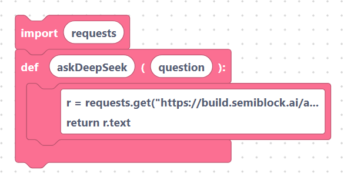
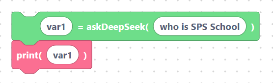
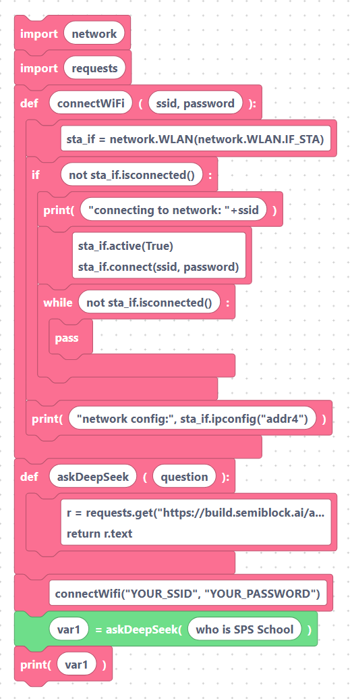

# `askDeepSeek`: calling an LLM from the board

The `askDeepSeek` block sends a question to a DeepSeek LLM endpoint and stores
the reply in a variable. It is the only block in the **Generative AI** category.

## The block

> {width=inherit}

The block reads:

```
[ var1 ] = askDeepSeek( [ who is SPS School ] )
```

It has two text inputs:

| Input        | Default            | Meaning                                          |
|--------------|--------------------|--------------------------------------------------|
| `var_name`   | `var1`             | The variable that receives the answer.           |
| `question`   | `who is SPS School`| The text you want to ask the model.              |

## Exact generated MicroPython

For the default block above, SemiBlock generates:

```python
var1=askDeepSeek("who is SPS School")
```

> {width=inherit}

The question text is wrapped in double quotes, and the result is assigned to
your variable name.

### The injected helper

Whenever your program uses `askDeepSeek`, SemiBlock automatically adds this
helper function and import at the top of the generated code — you do **not**
draw it yourself:

```python
import requests

def askDeepSeek(question):
    r = requests.get("https://build.semiblock.ai/api/deepseek/"+question)
    return r.text
```

> {width=inherit}

So `askDeepSeek` simply makes an HTTP GET request to
`https://build.semiblock.ai/api/deepseek/` with your question appended to the
URL, and returns the response body as text.

## How the response comes back

`r.text` is the raw text of the HTTP response, so your variable holds a plain
string. You can use it like any other string:

```python
var1=askDeepSeek("who is SPS School")
print(var1)
```

> {width=inherit}

Remember that the request travels over the network, so:

- **Wi-Fi must be connected first** (see the
  [overview](index.md) for the `connectWifi` snippet).
- The call blocks until the server replies, so the answer may take a moment.

A complete minimal program:

```python
import network
import requests

def connectWifi(ssid, password):
    sta_if = network.WLAN(network.WLAN.IF_STA)
    if not sta_if.isconnected():
        print('connecting to network: '+ssid)
        sta_if.active(True)
        sta_if.connect(ssid, password)
        while not sta_if.isconnected():
            pass
    print('network config:', sta_if.ipconfig('addr4'))

def askDeepSeek(question):
    r = requests.get("https://build.semiblock.ai/api/deepseek/"+question)
    return r.text

connectWifi("YOUR_SSID", "YOUR_PASSWORD")
var1=askDeepSeek("who is SPS School")
print(var1)
```

> {width=inherit}

## Next

Continue to [Practical patterns: chatbot, sensor explainer, voice prompt](patterns.md).
