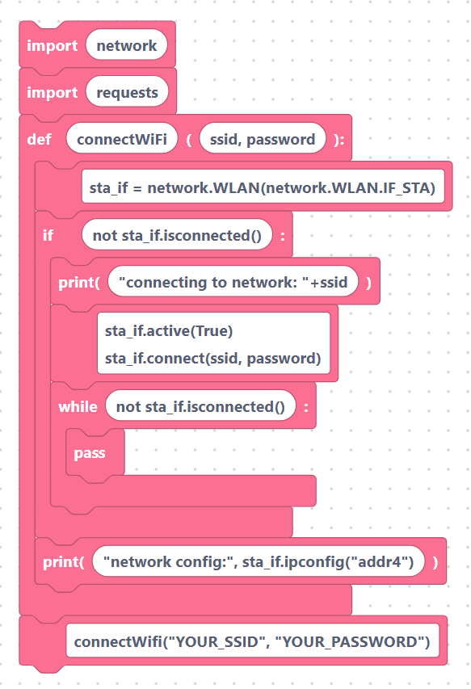

# Generative AI Overview

> {width=inherit}

The **Generative AI** category lets your ESP32 board talk to a Large Language
Model (LLM). It has a single block, `askDeepSeek`, which sends a text question
over the internet and gives you the answer back as a string.

Because the board has no AI model of its own, `askDeepSeek` works by making an
HTTP request to a SemiBlock cloud endpoint. That means **Wi-Fi must be connected
first** — without a network connection the request will fail.

## What `askDeepSeek` does

When you use the block, SemiBlock generates a tiny helper function and a call to
it. The helper sends your question to the DeepSeek endpoint and returns the
reply text, which you store in a variable:

```python
var1=askDeepSeek("who is SPS School")
```

> {width=inherit}

You can then `print()` the variable, show it on an OLED, or feed it into other
blocks.

## Wi-Fi prerequisite

Connect to Wi-Fi before calling `askDeepSeek`. SemiBlock uses this standard
`network.WLAN` connect helper — run it once near the top of your program:

```python
import network
import requests

def connectWifi(ssid, password):
    sta_if = network.WLAN(network.WLAN.IF_STA)
    if not sta_if.isconnected():
        print('connecting to network: '+ssid)
        sta_if.active(True)
        sta_if.connect(ssid, password)
        while not sta_if.isconnected():
            pass
    print('network config:', sta_if.ipconfig('addr4'))

connectWifi("YOUR_SSID", "YOUR_PASSWORD")
```

> {width=inherit}

Replace `YOUR_SSID` and `YOUR_PASSWORD` with your network name and password.

## In this part

- [`askDeepSeek`: calling an LLM from the board](ask-deepseek.md) — the block's
  inputs, the exact generated MicroPython, and how the reply comes back.
- [Practical patterns: chatbot, sensor explainer, voice prompt](patterns.md) —
  complete worked examples combining `askDeepSeek` with other SemiBlock blocks.

## Next

Continue to [`askDeepSeek`: calling an LLM from the board](ask-deepseek.md).
