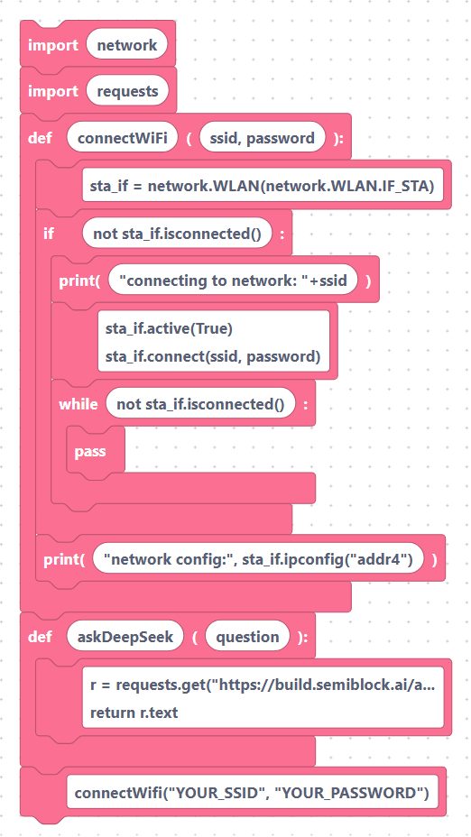
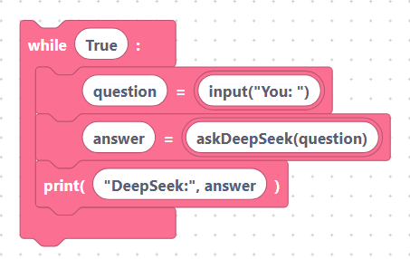
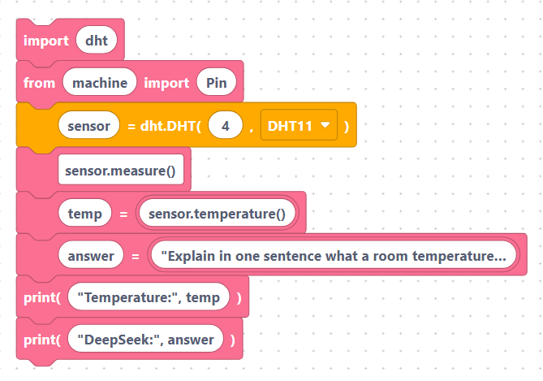
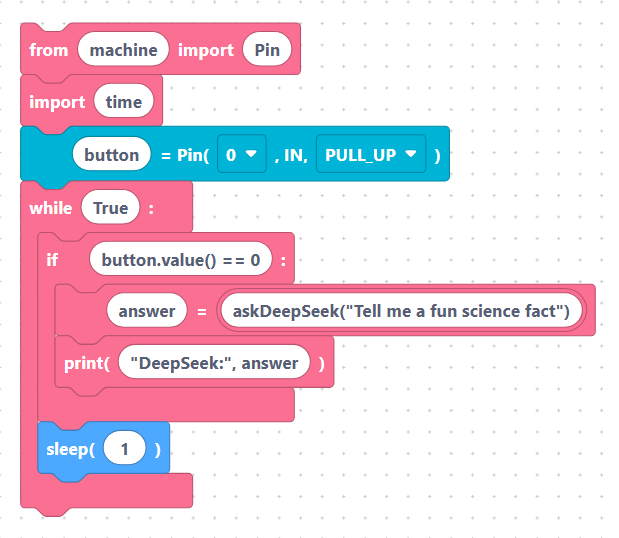

# Practical patterns: chatbot, sensor explainer, voice prompt

These worked examples combine `askDeepSeek` with other SemiBlock blocks. Each
one assumes Wi-Fi is connected and the `askDeepSeek` helper is present — both are
added automatically when you use the block (see the
[overview](index.md)). The snippets below include them so you can read the whole
program at a glance.

The shared setup used in every example:

```python
import network
import requests

def connectWifi(ssid, password):
    sta_if = network.WLAN(network.WLAN.IF_STA)
    if not sta_if.isconnected():
        print('connecting to network: '+ssid)
        sta_if.active(True)
        sta_if.connect(ssid, password)
        while not sta_if.isconnected():
            pass
    print('network config:', sta_if.ipconfig('addr4'))

def askDeepSeek(question):
    r = requests.get("https://build.semiblock.ai/api/deepseek/"+question)
    return r.text

connectWifi("YOUR_SSID", "YOUR_PASSWORD")
```

> {width=inherit}

## 1. Simple chatbot loop

Read a question typed in the REPL, ask the model, and print the answer — forever.

```python
while True:
    question = input("You: ")
    answer = askDeepSeek(question)
    print("DeepSeek:", answer)
```

> {width=inherit}

Each loop sends one question and waits for one reply before asking again.

## 2. Sensor-reading explainer

Read a temperature from a DHT sensor, then ask the model to explain the value in
plain language. This combines `askDeepSeek` with the DHT blocks.

```python
import dht
from machine import Pin

sensor = dht.DHT11(Pin(4))
sensor.measure()
temp = sensor.temperature()

answer = askDeepSeek("Explain in one sentence what a room temperature of " + str(temp) + " degrees Celsius feels like")
print("Temperature:", temp)
print("DeepSeek:", answer)
```

> {width=inherit}

Note how the numeric reading is turned into text with `str(temp)` before being
joined into the question.

## 3. Voice / prompt example

Trigger a question when a button is pressed, so the board "asks" on demand. This
pairs `askDeepSeek` with a digital input.

```python
from machine import Pin
import time

button = Pin(0, Pin.IN, Pin.PULL_UP)

while True:
    if button.value() == 0:          # button pressed (active low)
        answer = askDeepSeek("Tell me a fun science fact")
        print("DeepSeek:", answer)
        time.sleep(1)                # simple debounce
```

> {width=inherit}

Every press sends a fixed prompt and prints the model's reply. You could swap the
prompt for text captured elsewhere in your project, or show `answer` on an OLED
instead of printing it.

## Next

Return to the [Generative AI Overview](index.md), or continue to the
[Projects](../projects/ai-assistant.md) section.
