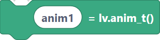
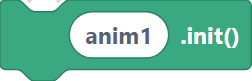
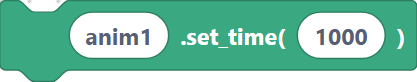
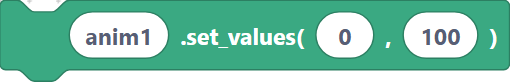
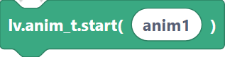
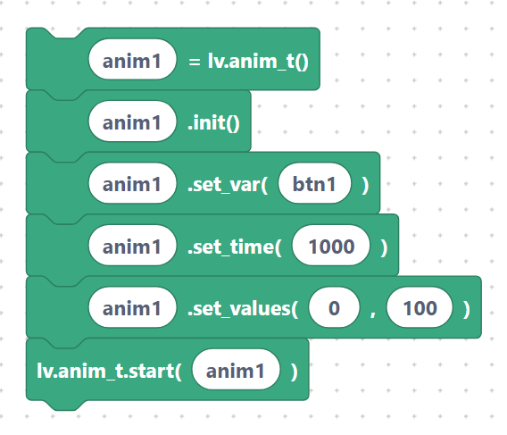

# Animation: create, init, `setVar`, `setTime`, `setValues`, start

LVGL can animate a property over time. You build an animation object, point it at a
target, set the duration and value range, then start it.

The blocks below map to the LVGL `anim_t` workflow. Use them in order: create → init →
configure → start.

## `lvglAnimCreate` — create an animation

**Inputs:** anim name.

```python
anim1 = lv.anim_t()
```

> {width=inherit}

## `lvglAnimInit` — initialize it

Resets the animation object to defaults before you configure it.

**Inputs:** anim name.

```python
anim1.init()
```

> {width=inherit}

## `lvglAnimSetVar` — set the target object

Tells the animation which object it acts on.

**Inputs:** anim name, object name.

```python
anim1.set_var(btn1)
```

> {width=inherit}

## `lvglAnimSetTime` — set the duration

Duration in milliseconds.

**Inputs:** anim name, time.

```python
anim1.set_time(1000)
```

> {width=inherit}

## `lvglAnimSetValues` — set start and end values

The animation runs from `start` to `end`.

**Inputs:** anim name, start, end.

```python
anim1.set_values(0, 100)
```

> {width=inherit}

## `lvglAnimStart` — start the animation

**Inputs:** anim name.

```python
lv.anim_t.start(anim1)
```

> {width=inherit}

## Full sequence

```python
anim1 = lv.anim_t()
anim1.init()
anim1.set_var(btn1)
anim1.set_time(1000)
anim1.set_values(0, 100)
lv.anim_t.start(anim1)
```

> {width=inherit}

> To choose *which* property animates (x, y, width, opacity…) you also set an exec
> callback in LVGL. The blocks above cover the common timing and value setup.

## Next

Continue to [Flags: `addFlag`, `clearFlag`, `removeFlag`](flags.md).
