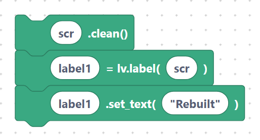

# Cleanup: `objDelete`, `objClean`, `objInvalidate`

When a UI changes, you often need to remove widgets or force a redraw. These three
blocks manage an object's lifecycle.

## `lvglObjDelete` — delete an object

Permanently removes the object (and all its children) from memory. Don't use the
variable afterwards.

**Inputs:** object name.

```python
btn1.delete()
```

> {width=inherit}

## `lvglObjClean` — remove an object's children

Deletes everything **inside** an object but keeps the object itself. Great for clearing
a screen or container before rebuilding its contents.

**Inputs:** object name.

```python
scr.clean()
```

> {width=inherit}

## `lvglObjInvalidate` — mark for redraw

Tells LVGL the object needs to be redrawn on the next cycle. Useful after manually
changing something LVGL didn't notice.

**Inputs:** object name.

```python
btn1.invalidate()
```

> {width=inherit}

## Rebuild-a-screen example

Clear a screen's contents, then add a fresh label:

```python
scr.clean()
label1 = lv.label(scr)
label1.set_text("Rebuilt")
```

> {width=inherit}

> Reach for `clean()` when you want to keep a screen but swap out what's on it, and
> `delete()` when you're done with a widget for good.

## Next

Continue to [Tick: `lvglTickInc`](tick.md).
