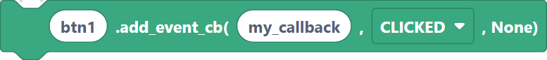
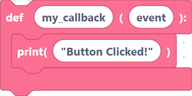
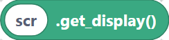
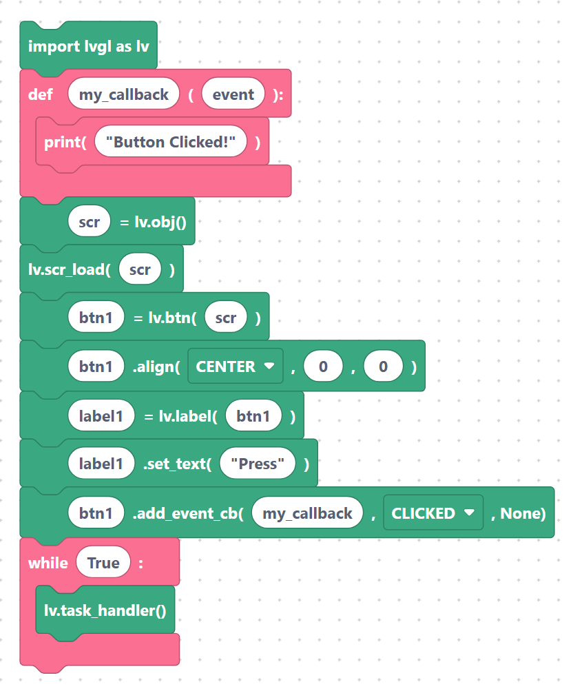

# Events: `addEventCb`

Widgets become interactive when you attach an **event callback** — a function LVGL
calls when something happens (a click, a value change, focus, and so on).

## `lvglAddEventCb` — attach a callback

Registers a callback function for a given event type on an object. The third argument
is user data, which SemiBlock passes as `None`.

**Inputs:** object name, callback, event.

```python
btn1.add_event_cb(my_callback, lv.EVENT.CLICKED, None)
```

> {width=inherit}

The callback receives the event object. A typical handler:

```python
def my_callback(event):
    print("Button clicked!")
```

> {width=inherit}

## `lvglGetDisplay` — get an object's display

A value block that returns the display a screen belongs to — useful when a function
needs the display handle.

**Inputs:** screen name.

```python
scr.get_display()
```

> {width=inherit}

## Full interactive example

A button that prints a message each time it is clicked:

```python
import lvgl as lv

def my_callback(event):
    print("Button clicked!")

scr = lv.obj()
lv.scr_load(scr)
btn1 = lv.btn(scr)
btn1.align(lv.ALIGN.CENTER, 0, 0)
label1 = lv.label(btn1)
label1.set_text("Press")
btn1.add_event_cb(my_callback, lv.EVENT.CLICKED, None)
while True:
    lv.task_handler()
```

> {width=inherit}

> Define the callback function **before** the `add_event_cb` block so the name exists
> when it is referenced.

## Next

Continue to [Animation: create, init, `setVar`, `setTime`, `setValues`, start](animation.md).
