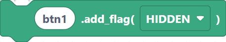
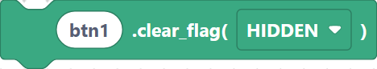
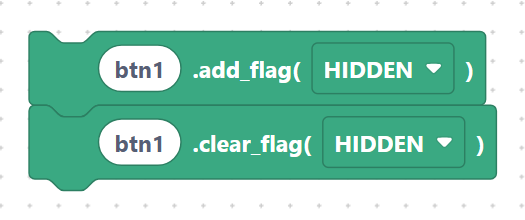

# Flags: `addFlag`, `clearFlag`, `removeFlag`

**Flags** turn object behaviours on and off — things like whether an object is hidden,
clickable, or scrollable. You change them with `add_flag`, `clear_flag`, and
`remove_flag`, passing an `lv.obj.FLAG.*` value.

Common flags include `lv.obj.FLAG.HIDDEN`, `lv.obj.FLAG.CLICKABLE`, and
`lv.obj.FLAG.SCROLLABLE`.

## `lvglAddFlag` — turn a flag on

**Inputs:** object name, flag.

```python
btn1.add_flag(lv.obj.FLAG.HIDDEN)
```

> {width=inherit}

## `lvglClearFlag` — turn a flag off

**Inputs:** object name, flag.

```python
btn1.clear_flag(lv.obj.FLAG.HIDDEN)
```

> {width=inherit}

## `lvglRemoveFlag` — remove a flag

**Inputs:** object name, flag.

```python
btn1.remove_flag(lv.obj.FLAG.SCROLLABLE)
```

> {width=inherit}

## Show / hide example

Hide a button, then reveal it again:

```python
btn1.add_flag(lv.obj.FLAG.HIDDEN)
btn1.clear_flag(lv.obj.FLAG.HIDDEN)
```

> {width=inherit}

> `clear_flag` and `remove_flag` both switch a flag off. Use whichever block reads more
> naturally in your program — the generated method differs (`clear_flag` vs
> `remove_flag`) but the effect of turning a flag off is the same.

## Next

Continue to [Cleanup: `objDelete`, `objClean`, `objInvalidate`](cleanup.md).
