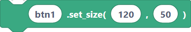
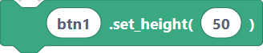
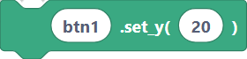
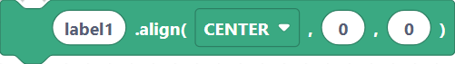
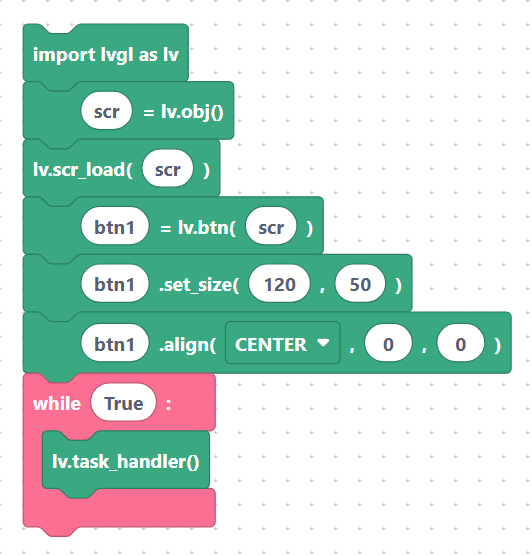

# Positioning & sizing: `setPos`, `setSize`, `align`

By default LVGL places widgets at the top-left of their parent. These blocks move and
resize them. Coordinates are in pixels, relative to the parent object.

## `lvglSetPos` — set position

Moves an object to an absolute (x, y) inside its parent.

**Inputs:** object name, x, y.

```python
label1.set_pos(10, 20)
```

> {width=inherit}

## `lvglSetSize` — set width and height

**Inputs:** object name, width, height.

```python
btn1.set_size(120, 50)
```

> {width=inherit}

## `lvglSetWidth` — set width only

**Inputs:** object name, width.

```python
btn1.set_width(120)
```

> {width=inherit}

## `lvglSetHeight` — set height only

**Inputs:** object name, height.

```python
btn1.set_height(50)
```

> {width=inherit}

## `lvglSetX` — set x only

**Inputs:** object name, x.

```python
btn1.set_x(10)
```

> {width=inherit}

## `lvglSetY` — set y only

**Inputs:** object name, y.

```python
btn1.set_y(20)
```

> {width=inherit}

## `lvglAlign` — align within the parent

Aligns an object to a named anchor (center, top-left, etc.) with an optional offset.
This is the easiest way to centre things.

**Inputs:** object name, align, x offset, y offset.

```python
label1.align(lv.ALIGN.CENTER, 0, 0)
```

> {width=inherit}

## Example

```python
import lvgl as lv
scr = lv.obj()
lv.scr_load(scr)
btn1 = lv.btn(scr)
btn1.set_size(120, 50)
btn1.align(lv.ALIGN.CENTER, 0, 0)
while True:
    lv.task_handler()
```

> {width=inherit}

## Next

Continue to [Styling: colors, opacity, font, radius, padding, border, shadow](styles.md).
