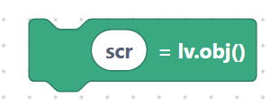
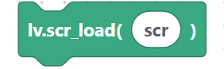
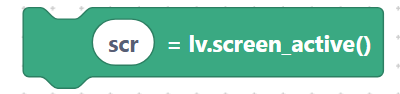
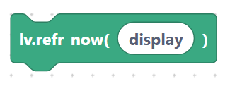
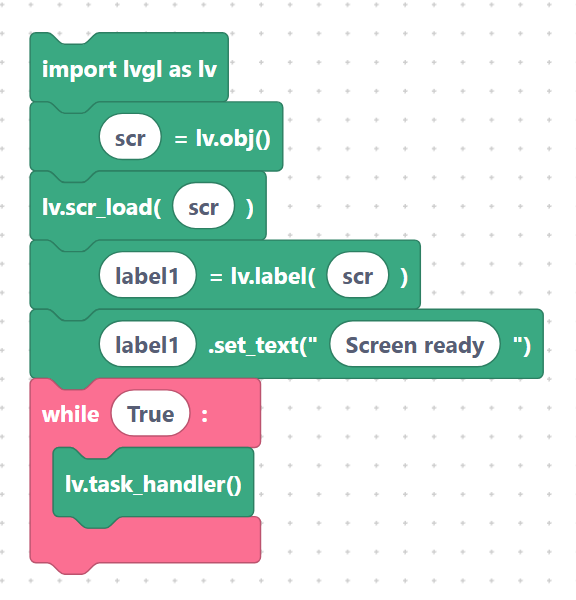

# Screens: create, load, active, `refrNow`

A **screen** is the top-level canvas your widgets live on. You create one, load it to
make it visible, and (optionally) grab the currently active screen to add widgets to it.

## `lvglScreenCreate` — create a screen

Creates a blank object to use as a screen.

**Inputs:** screen name.

```python
scr = lv.obj()
```

> {width=inherit}

## `lvglScreenLoad` — show a screen

Makes the given screen the active one. Anything you drew on other screens is hidden.

**Inputs:** screen name.

```python
lv.scr_load(scr)
```

> {width=inherit}

## `lvglScreenActive` — get the active screen

Stores the currently active screen into a variable so you can add widgets to it. Handy
on boards that already create a screen during boot.

**Inputs:** screen name (the variable to assign).

```python
scr = lv.screen_active()
```

> {width=inherit}

## `lvglRefrNow` — refresh immediately

Forces an immediate redraw of the display, instead of waiting for the next task-handler
cycle.

**Inputs:** screen name (the display).

```python
lv.refr_now(display)
```

> {width=inherit}

## Example: two-step screen setup

```python
import lvgl as lv
scr = lv.obj()
lv.scr_load(scr)
label1 = lv.label(scr)
label1.set_text("Screen ready")
while True:
    lv.task_handler()
```

> {width=inherit}

> Tip: build all widgets on a screen **before** loading it for the smoothest
> appearance, then switch screens to navigate between pages.

## Next

Continue to [Widgets — Labels & Buttons](widgets-basic.md).
