# Styling: colors, opacity, font, radius, padding, border, shadow

Styling blocks change how a widget looks. They all call a `set_style_*` method and end
with a trailing `0` — the **style state** (0 = the default/normal state). Colours use
`lv.color_hex(0xRRGGBB)`.

## `lvglSetBgColor` — background colour

**Inputs:** object name, color.

```python
btn1.set_style_bg_color(lv.color_hex(0x2196F3), 0)
```

> 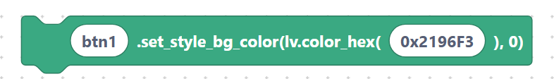{width=inherit}

## `lvglSetTextColor` — text colour

**Inputs:** object name, color.

```python
label1.set_style_text_color(lv.color_hex(0xFFFFFF), 0)
```
> 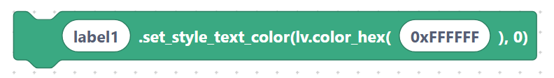{width=inherit}

## `lvglSetOpacity` — overall opacity

**Inputs:** object name, opacity (0–255).

```python
btn1.set_style_opa(128, 0)
```

> 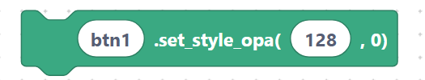{width=inherit}

## `lvglSetStyleTextFont` — text font

**Inputs:** object name, font.

```python
label1.set_style_text_font(lv.font_montserrat_28, 0)
```

> 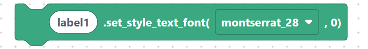{width=inherit}

## `lvglSetStyleBgOpa` — background opacity

**Inputs:** object name, opacity.

```python
btn1.set_style_bg_opa(255, 0)
```

> 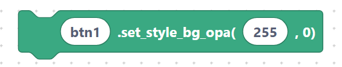{width=inherit}

## `lvglSetStyleRadius` — corner radius

**Inputs:** object name, radius.

```python
btn1.set_style_radius(10, 0)
```

> 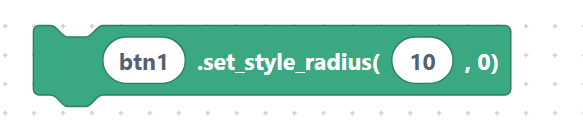{width=inherit}

## `lvglSetStylePad` — padding (all sides)

**Inputs:** object name, padding.

```python
container.set_style_pad_all(8, 0)
```

> 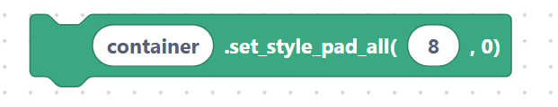{width=inherit}

## `lvglSetStyleBorderWidth` / `lvglSetStyleBorderColor`

**Inputs:** object name, width / color.

```python
btn1.set_style_border_width(2, 0)
```

> 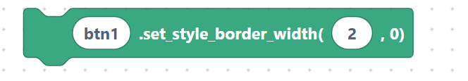{width=inherit}

```python
btn1.set_style_border_color(lv.color_hex(0x000000), 0)
```

> 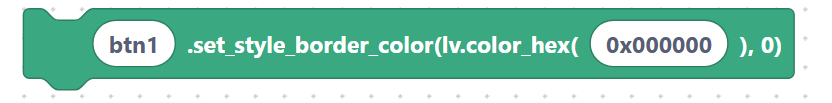{width=inherit}

## `lvglSetStyleShadowWidth` / `lvglSetStyleShadowColor`

**Inputs:** object name, width / color.

```python
btn1.set_style_shadow_width(15, 0)
```

> 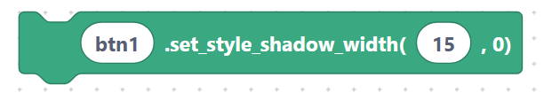{width=inherit}

```python
btn1.set_style_shadow_color(lv.color_hex(0x808080), 0)
```

> 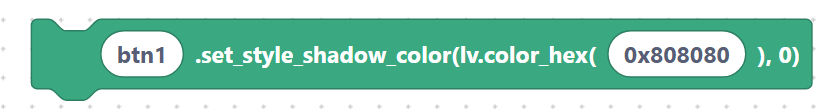{width=inherit}

## `lvglColorHex` — a colour value

A value block you can plug into any colour input.

**Inputs:** color.

```python
lv.color_hex(0xFF0000)
```

> {width=inherit}

## Next

Continue to [Events: `addEventCb`](events.md).
