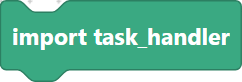
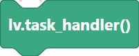
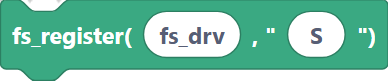

# Task handler, FS driver, scrollbar mode

These blocks keep LVGL running and connect it to extra services: the redraw loop, a
filesystem driver (so widgets can load images/fonts by path), and scrollbar behaviour.

> Requires **`lv_micropython`** firmware. The `task_handler` and `fs_driver` helpers
> are part of the SemiBlock LVGL build.

## `importTaskHandler` — import the task handler

```python
import task_handler
```

> {width=inherit}

## `importFsDriver` — import the FS driver helper

```python
from fs_driver import fs_register
```

> {width=inherit}

## `taskHandlerInit` — start the task handler

Creates a `TaskHandler`, which runs `lv.task_handler()` for you in the background so
LVGL keeps redrawing without you writing the loop.

**Inputs:** var name.

```python
th = task_handler.TaskHandler()
```

> {width=inherit}

## `lvglTaskHandler` — run one cycle manually

If you are not using a `TaskHandler`, call this inside your own loop.

```python
lv.task_handler()
```

> {width=inherit}

## `lvglRefrNow` — force an immediate refresh

Redraws a display right away instead of waiting for the next cycle.

**Inputs:** screen name (the display).

```python
lv.refr_now(display)
```

> {width=inherit}

## `lvglFsDrvtInit` — create a filesystem driver object

**Inputs:** var name.

```python
fs_drv = lv.fs_drv_t()
```

> {width=inherit}

## `lvglFsRegister` — register a drive letter

Maps the FS driver to a drive letter (e.g. `"S"`) so paths like `"S:logo.png"` work.

**Inputs:** fs driver, letter.

```python
fs_register(fs_drv, "S")
```

> {width=inherit}

## `lvglSetScrollbarMode` — scrollbar behaviour

Sets when an object shows scrollbars (e.g. off, on, auto).

**Inputs:** object, mode.

```python
container.set_scrollbar_mode(lv.SCROLLBAR_MODE.AUTO)
```

## Next

Continue to [Screens: create, load, active, `refrNow`](screens.md).
