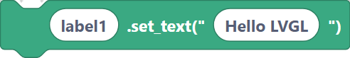
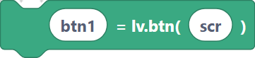
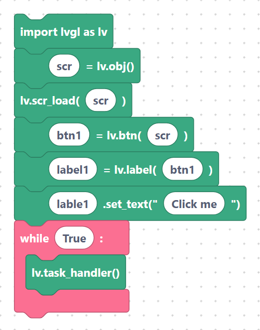

# Widgets — Labels & Buttons

Labels and buttons are the two most common LVGL widgets. A **label** shows text; a
**button** is a clickable box you usually put a label inside. Every widget is created
with a **parent** so LVGL knows where to place it.

## `lvglLabelCreate` — create a label

**Inputs:** label name, parent.

```python
label1 = lv.label(scr)
```

> {width=inherit}

## `lvglLabelSetText` — set label text

Sets the text shown by the label. The text is wrapped in quotes automatically.

**Inputs:** label name, text.

```python
label1.set_text("Hello LVGL")
```

> {width=inherit}

## `lvglButtonCreate` — create a button

Creates a clickable button on the given parent. To label it, create a child label with
the button as its parent.

**Inputs:** button name, parent.

```python
btn1 = lv.btn(scr)
```

> {width=inherit}

## Putting it together

A button with a label inside it, on a loaded screen:

```python
import lvgl as lv
scr = lv.obj()
lv.scr_load(scr)
btn1 = lv.btn(scr)
label1 = lv.label(btn1)
label1.set_text("Click me")
while True:
    lv.task_handler()
```

> {width=inherit}

To make the button **do** something when pressed, attach a callback — see
[Events: `addEventCb`](events.md). To move or resize it, see
[Positioning & sizing](layout.md).

## Next

Continue to [Widgets — Container, Slider, Bar, Arc, Spinner](widgets-indicators.md).
