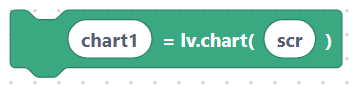
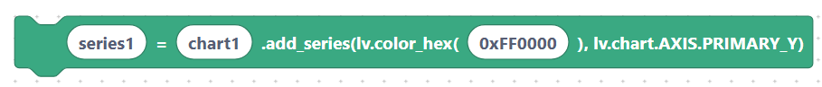
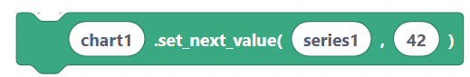
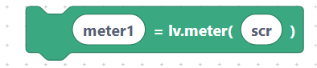
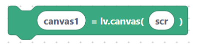
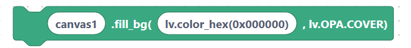
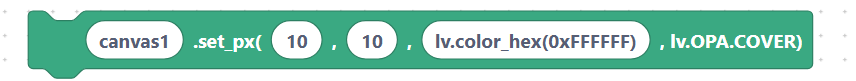
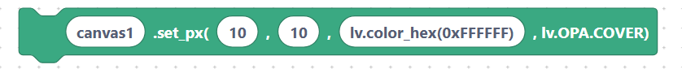

# Widgets — Chart, Meter, Canvas

These widgets visualize data. A **chart** plots series of points; a **meter** shows a
gauge; a **canvas** is a raw pixel surface you draw on directly.

## `lvglChartCreate` — chart

**Inputs:** chart name, parent.

```python
chart1 = lv.chart(scr)
```

> {width=inherit}

## `lvglChartAddSeries` — add a data series

Creates a coloured line/series on the chart and stores it in a variable.

**Inputs:** series name, chart name, color.

```python
series1 = chart1.add_series(lv.color_hex(0xFF0000), lv.chart.AXIS.PRIMARY_Y)
```

> {width=inherit}

## `lvglChartSetPoint` — push a value

Adds the next point to a series (scrolls the chart left as new data arrives).

**Inputs:** chart name, series name, value.

```python
chart1.set_next_value(series1, 42)
```

> {width=inherit}

## `lvglMeterCreate` — meter

A circular gauge widget.

**Inputs:** meter name, parent.

```python
meter1 = lv.meter(scr)
```

> {width=inherit}

## `lvglCanvasCreate` — canvas

A surface you can draw individual pixels and shapes on.

**Inputs:** canvas name, parent.

```python
canvas1 = lv.canvas(scr)
```

> {width=inherit}

## `lvglCanvasSetBuffer` — attach a pixel buffer

Gives the canvas memory to draw into, with a width, height, and colour format.

**Inputs:** canvas name, buffer, width, height.

```python
canvas1.set_buffer(buf, 100, 100, lv.COLOR_FORMAT.RGB565)
```

> {width=inherit}

## `lvglCanvasFillBg` — fill the background

**Inputs:** canvas name, color.

```python
canvas1.fill_bg(lv.color_hex(0x000000), lv.OPA.COVER)
```

> {width=inherit}

## `lvglCanvasSetPx` — set one pixel

**Inputs:** canvas name, x, y, color.

```python
canvas1.set_px(10, 10, lv.color_hex(0xFFFFFF), lv.OPA.COVER)
```

> {width=inherit}

## Next

Continue to [Positioning & sizing: `setPos`, `setSize`, `align`](layout.md).
