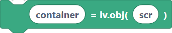
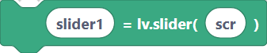
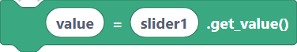
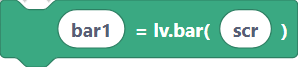
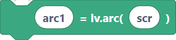
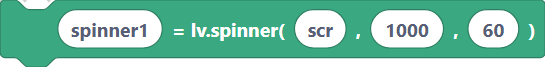

# Widgets — Container, Slider, Bar, Arc, Spinner

These widgets group content and show values. A **container** holds other widgets; a
**slider** lets the user pick a value; a **bar** and an **arc** display a value; a
**spinner** shows an indeterminate "loading" animation.

## `lvglContainerCreate` — container

A plain object used to group and lay out other widgets.

**Inputs:** container name, parent.

```python
container = lv.obj(scr)
```

> {width=inherit}

## `lvglSliderCreate` — slider

**Inputs:** slider name, parent.

```python
slider1 = lv.slider(scr)
```

> {width=inherit}

## `lvglSliderSetValue` — set slider value

**Inputs:** slider name, value, anim (animation on/off).

```python
slider1.set_value(50, lv.ANIM.OFF)
```

> {width=inherit}

## `lvglSliderGetValue` — read slider value

Stores the current slider value into a variable.

**Inputs:** var name, slider name.

```python
value = slider1.get_value()
```

> {width=inherit}

## `lvglBarCreate` — bar

A non-interactive progress bar.

**Inputs:** bar name, parent.

```python
bar1 = lv.bar(scr)
```

> {width=inherit}

## `lvglBarSetValue` — set bar value

**Inputs:** bar name, value, anim.

```python
bar1.set_value(70, lv.ANIM.OFF)
```

> {width=inherit}

## `lvglArcCreate` — arc

A circular indicator/dial.

**Inputs:** arc name, parent.

```python
arc1 = lv.arc(scr)
```

> {width=inherit}

## `lvglArcSetValue` — set arc value

**Inputs:** arc name, value.

```python
arc1.set_value(30)
```

> {width=inherit}

## `lvglSpinnerCreate` — spinner

A spinning "loading" indicator.

**Inputs:** spinner name, parent, speed, angle.

```python
spinner1 = lv.spinner(scr, 1000, 60)
```

> {width=inherit}

## Next

Continue to [Widgets — Checkbox, Switch, Textarea, Dropdown, Roller](widgets-input.md).
