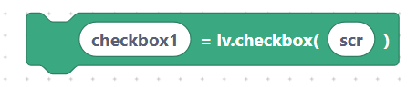
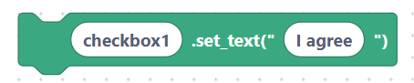
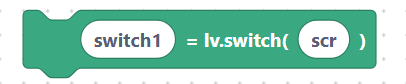
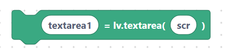
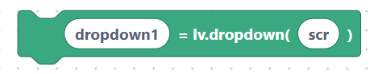
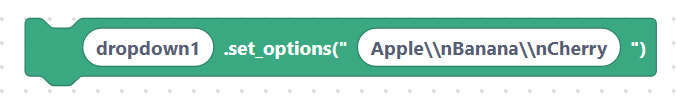
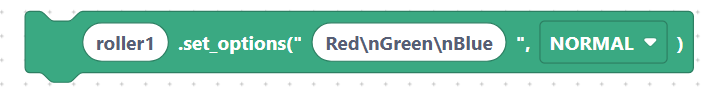

# Widgets — Checkbox, Switch, Textarea, Dropdown, Roller

These input widgets let the user make choices and enter text. Pair the text widgets
with the on-screen [keyboard](widgets-media.md) for touch input.

## `lvglCheckboxCreate` — checkbox

**Inputs:** checkbox name, parent.

```python
checkbox1 = lv.checkbox(scr)
```

> {width=inherit}

## `lvglCheckboxSetText` — checkbox label

**Inputs:** checkbox name, text.

```python
checkbox1.set_text("I agree")
```

> {width=inherit}

## `lvglSwitchCreate` — switch

An on/off toggle.

**Inputs:** switch name, parent.

```python
switch1 = lv.switch(scr)
```

> {width=inherit}

## `lvglTextareaCreate` — text area

A box the user can type into.

**Inputs:** textarea name, parent.

```python
textarea1 = lv.textarea(scr)
```

> {width=inherit}

## `lvglTextareaSetText` — set text area contents

**Inputs:** textarea name, text.

```python
textarea1.set_text("Type here")
```

> {width=inherit}

## `lvglDropdownCreate` — dropdown

**Inputs:** dropdown name, parent.

```python
dropdown1 = lv.dropdown(scr)
```

> {width=inherit}

## `lvglDropdownSetOptions` — dropdown items

Options are a single string separated by newlines (`\n`).

**Inputs:** dropdown name, options.

```python
dropdown1.set_options("Apple\nBanana\nCherry")
```

> {width=inherit}

## `lvglRollerCreate` — roller

A scrollable "drum" picker.

**Inputs:** roller name, parent.

```python
roller1 = lv.roller(scr)
```

> {width=inherit}

## `lvglRollerSetOptions` — roller items

**Inputs:** roller name, options, mode.

```python
roller1.set_options("Red\nGreen\nBlue", lv.roller.MODE.NORMAL)
```

> {width=inherit}

## Next

Continue to [Widgets — Image, LED, Keyboard, Tabview](widgets-media.md).
