# Widgets — Image, LED, Keyboard, Tabview

These widgets cover pictures, status lights, on-screen typing, and multi-page layouts.

## `lvglImageCreate` — image

**Inputs:** image name, parent.

```python
image1 = lv.image(scr)
```

> 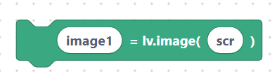{width=inherit}

## `lvglImageSetSrc` — set image source

Point the image at a file path or symbol.

**Inputs:** image name, src.

```python
image1.set_src("S:logo.png")
```

> 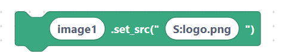{width=inherit}

## `lvglImageSetSrcCostume` — set image from a costume file

Loads from the SemiBlock costume filesystem (drive `S:`).

**Inputs:** image name, costume file.

```python
image1.set_src("S:cat.png")
```

> 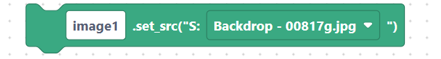{width=inherit}

## `lvglLedCreate` — LED

A round status light widget.

**Inputs:** led name, parent.

```python
led1 = lv.led(scr)
```

> 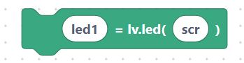{width=inherit}

## `lvglLedOn` / `lvglLedOff` / `lvglLedToggle`

**Inputs:** led name.

```python
led1.on()
```

> 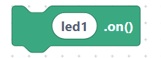{width=inherit}

```python
led1.off()
```

> 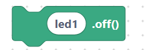{width=inherit}

```python
led1.toggle()
```

> 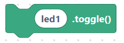{width=inherit}

## `lvglLedSetBrightness` — LED brightness

**Inputs:** led name, brightness (0–255).

```python
led1.set_brightness(200)
```

> 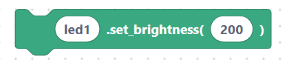{width=inherit}

## `lvglKeyboardCreate` — on-screen keyboard

**Inputs:** keyboard name, parent.

```python
keyboard1 = lv.keyboard(scr)
```

> 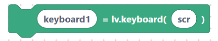{width=inherit}

## `lvglKeyboardSetTextarea` — link keyboard to a text area

Sends the keyboard's keystrokes into a text area.

**Inputs:** keyboard name, textarea name.

```python
keyboard1.set_textarea(textarea1)
```

> 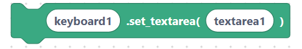{width=inherit}

## `lvglTabviewCreate` — tabbed view

**Inputs:** tabview name, parent, direction.

```python
tabview1 = lv.tabview(scr, lv.DIR.TOP)
```

> 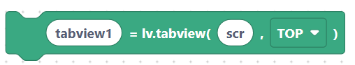{width=inherit}

## `lvglTabviewAddTab` — add a tab

Returns the tab's content object so you can add widgets to it.

**Inputs:** tab name, tabview name, title.

```python
tab1 = tabview1.add_tab("Home")
```

> 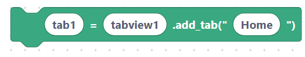{width=inherit}

## Next

Continue to [Widgets — Chart, Meter, Canvas](widgets-data.md).
