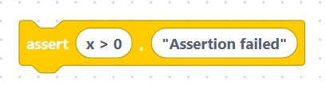
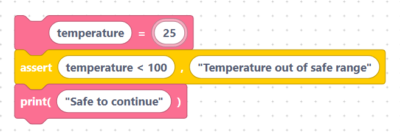

# `assert`

An `assert` checks that something you *expect* to be true really is. If it isn't,
the program stops with an error. It is a quick way to catch bugs early.

## The `assertStatement` block

- **Label:** `assert %1, %2`
- **Inputs:**
  - `condition` — the thing that should be true (default `x > 0`).
  - `message` — the error text shown if it isn't (default `"Assertion failed"`).

Both fields are inserted **verbatim**, so write the message with quotes:

```python
assert x > 0, "Assertion failed"
```

> {width=inherit}


If `x > 0` is true, nothing happens and the program continues. If it is false,
the program stops and shows the message.

## Worked example

```python
temperature = 25
assert temperature < 100, "Temperature out of safe range"
print("Safe to continue")
```

> {width=inherit}


Because `25 < 100` is true, the assert passes and `Safe to continue` is printed.

> Tip: use `assert` for sanity checks during development. For errors you expect
> to handle at run time, prefer [`try` / `except`](try-except.md) instead.

## Next

Continue to [Regular Expressions](../regex/index.md)
