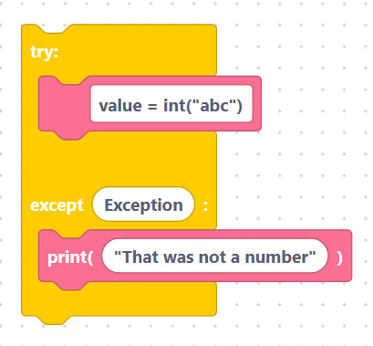

# Exception Handling

Sometimes code goes wrong — a file is missing, a number can't be parsed, a sensor
doesn't answer. **Exception handling** lets your program catch these problems and
respond instead of crashing.

The Exception category has blocks for trying risky code, raising your own errors,
and checking assumptions.

## What you will learn

- [`try` / `except` / `finally`](try-except.md)
- [`raise`](raise.md)
- [`assert`](assert.md)

## A quick taste

```python
try:
	value = int("abc")
except Exception:
	print("That was not a number")
```

> 

## Next

Continue to [`try` / `except` / `finally`](try-except.md)
