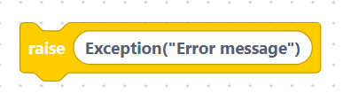
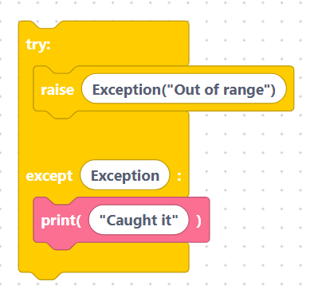
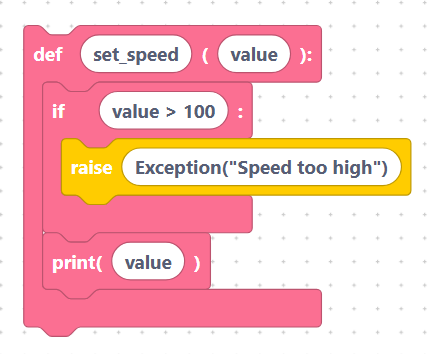

# `raise`

Sometimes *you* want to signal that something is wrong — for example a value is
out of range. The `raise` block deliberately triggers an error.

## The `raiseException` block

- **Label:** `raise %1`
- **Input:** `exception` (default `Exception("Error message")`).

The field is inserted **verbatim**, so include the full exception expression:

```python
raise Exception("Error message")
```

> 

You can type any error type and message you like, such as
`ValueError("temperature too high")`.

## Catching what you raise

A raised exception travels up until an [`except`](try-except.md) block catches
it:

```python
try:
	raise Exception("Out of range")
except Exception:
	print("Caught it")
```

> 

## Worked example

```python
def set_speed(value):
	if value > 100:
		raise Exception("Speed too high")
	print(value)
```

> 

Calling `set_speed(150)` would raise the error; `set_speed(80)` prints `80`.

## Next

Continue to [`assert`](assert.md)
