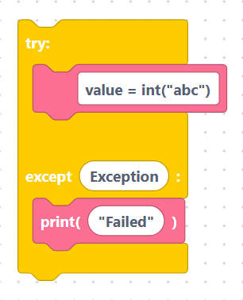
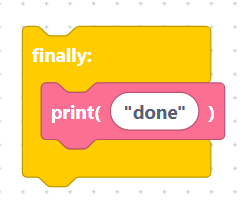
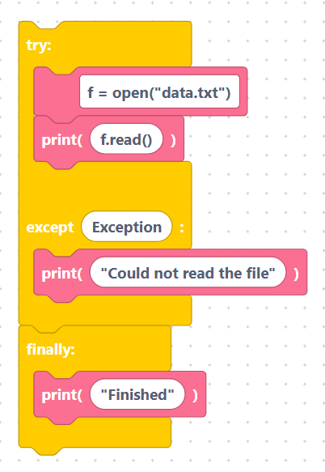

# `try` / `except` / `finally`

A `try` block runs code that might fail. If something goes wrong, the matching
`except` block runs instead of crashing. An optional `finally` block runs either
way.

## The `tryExcept` block

- **Label:** `try … except %1`
- **Input:** `exception` — the error type to catch (default `Exception`).
- **Bodies:** statements for the `try` part and the `except` part.

With the defaults and some code inside each part:

```python
try:
	value = int("abc")
except Exception:
	print("failed")
```

> {width=inherit}

`Exception` catches almost any error. You can type a more specific type such as
`ValueError` to catch only that one.

## The `finallyBlock` block

- **Label:** `finally`
- **Body:** statements that always run, whether or not an error happened.

```python
finally:
	print("done")
```

> {width=inherit}

Attach it after a `try`/`except` block to clean up — for example to close a file
or turn off a motor.

## Worked example

```python
try:
	f = open("data.txt")
	print(f.read())
except Exception:
	print("Could not read the file")
finally:
	print("Finished")
```

> {width=inherit}

## Next

Continue to [`raise`](raise.md)
