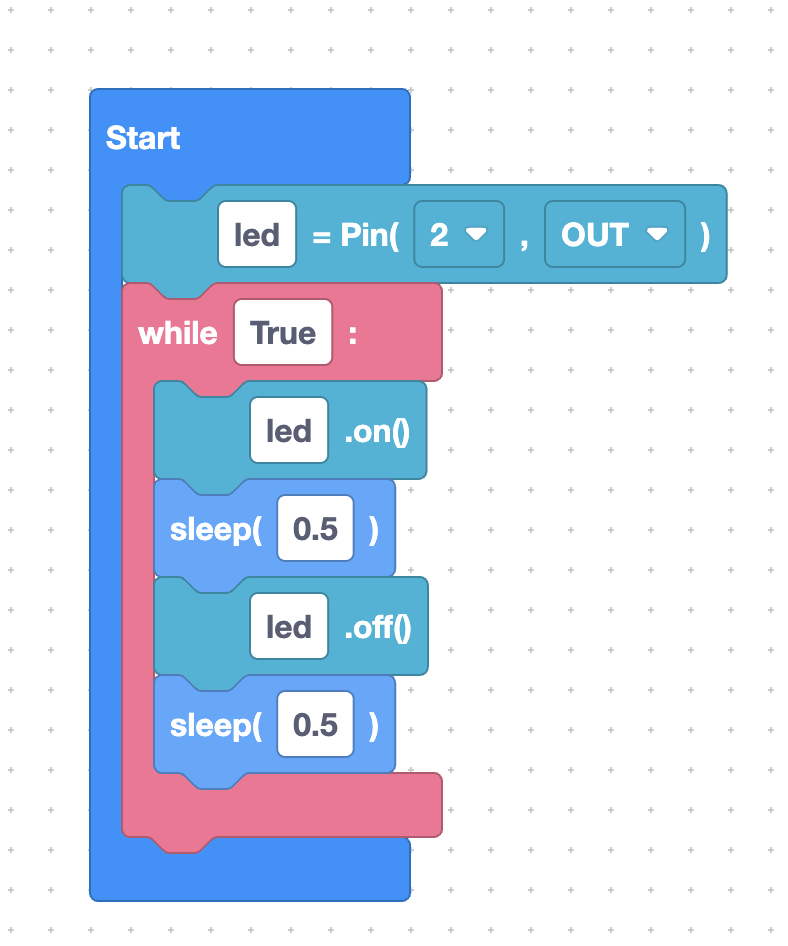
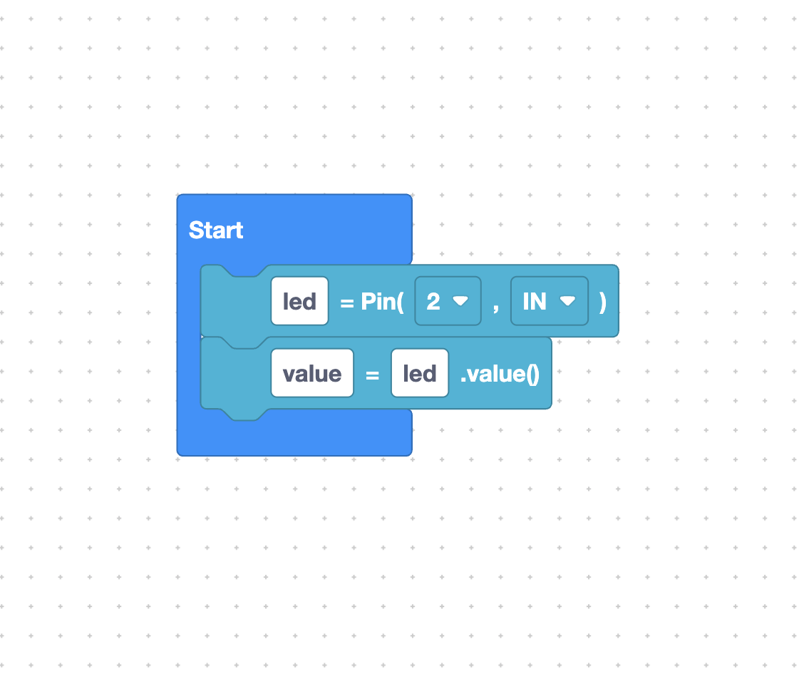

Blinking an LED is the "hello world" of hardware. In this page you'll build it entirely from blocks, watch SemiBlock generate the MicroPython, and understand every line. We'll use blocks from the **Pin** and **Machine** categories plus a loop from the **Language** category.

## The plan

A blink is just four ideas repeated forever:

1. Set up a pin connected to the LED.
2. Turn the LED **on**.
3. Wait a moment.
4. Turn the LED **off**, wait again, repeat.

## The blocks you'll use

| Block label            | Category | What it does                                   |
| ---------------------- | -------- | ---------------------------------------------- |
| `%1 = Pin(%2, %3)`     | Pin      | Creates a pin object (e.g. `led`) as `OUT`.    |
| `%1.on()`              | Pin      | Drives the pin high — LED **on**.              |
| `%1.off()`             | Pin      | Drives the pin low — LED **off**.              |
| `while %1:`            | Language | Repeats the blocks inside while true.          |
| `sleep(...)`           | Machine  | Pauses for a number of seconds.                |

> The on-board LED on many ESP32 boards is wired to **GPIO 2**. If yours differs, change the pin number accordingly.

## Building it step by step

1. Drag the **`%1 = Pin(%2, %3)`** block (Pin category). Set the variable name to
   `led`, the pin number to `2`, and the direction to `OUT`.
2. Drag a **`while %1:`** block (Language category) and set its condition to
   `True` so it loops forever.
3. Inside the loop, snap in this order:
   - **`%1.on()`** with `led`
   - **`sleep`** with `0.5`
   - **`%1.off()`** with `led`
   - **`sleep`** with `0.5`



## The generated MicroPython

As you connect the blocks, the code pane fills in. The result looks like this:

```python
from machine import Pin
from time import sleep

led = Pin(2, Pin.OUT)

while True:
    led.on()
    sleep(0.5)
    led.off()
    sleep(0.5)
```

Read it top to bottom:

- `Pin(2, Pin.OUT)` makes GPIO 2 an output and names it `led`.
- `led.on()` / `led.off()` switch the LED.
- `sleep(0.5)` pauses half a second so the blink is visible.
- `while True:` keeps the cycle running forever.

## Reading a pin value (bonus block)

The Pin category also has **`%1=%2.value()`** (label `pinValue`). It *reads* a pin instead of writing it — handy later for buttons:



> Remember set the pin to "IN" for input

```python
state = button.value()
```

## Try it yourself

Make the LED blink **fast**: change both `sleep(0.5)` blocks to `sleep(0.1)`. Then make it blink slowly with `sleep(1)`. Watch how the same blocks produce different timing just by changing one number.

## Next

[Dragging blocks from the toolbox](toolbox-tour.md)
