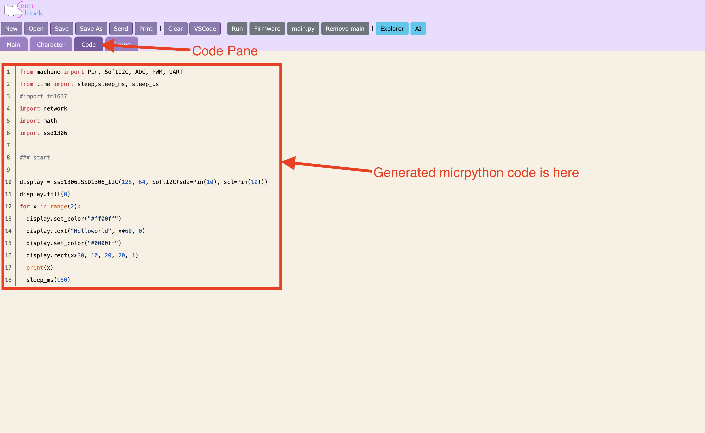

One of SemiBlock's best features is that it writes MicroPython for you **as you build**. There's no separate "compile" step. 

> the code pane updates the moment you change a block.

## Where the code appears

The left **code pane** (labeled *Generated MicroPython*) shows your program in real time. It is read-only: you edit blocks, not text, and the code follows.



## How generation works

Each block knows how to turn itself into a line (or several lines) of MicroPython. SemiBlock walks your blocks from top to bottom and joins the results into one program. Change a number, and only that line changes.

## A worked example

Suppose you've built the blink program. The blocks generate:

```python
from machine import Pin
from time import sleep

led = Pin(2, Pin.OUT)

while True:
    led.on()
    sleep(0.5)
    led.off()
    sleep(0.5)
```

Notice three things SemiBlock handled for you:

- **Imports** — it knows `Pin` needs `from machine import Pin`.
- **Indentation** — blocks inside the `while` loop are indented correctly.
- **Order** — statements appear in the order you stacked the blocks.

## The main method block

Most programs start with the **createMainMethod** block (Machine category). Everything you snap inside it becomes the body of your program. It keeps your generated code tidy and predictable.

## Reading the code to learn

Treat the code pane as a live tutor. Try this loop:

1. Add or change a block.
2. Look at exactly which line changed.
3. Predict the next change before you make it.

This habit turns block-building into real MicroPython fluency.

## Copying the code

Because the pane shows standard MicroPython, you can select the text and copy it into any MicroPython tool or editor. The next page shows how to get it onto the board and run it.

## Try it yourself

Build a two-line program: a **Pin** block (`led = Pin(2, Pin.OUT)`) followed by a single **`%1.on()`** block. Confirm the code pane shows the `from machine import Pin` line appear automatically. Then add **`sleep`** and watch a new import appear.

## Next

[Uploading and running on the board](upload-run.md)
