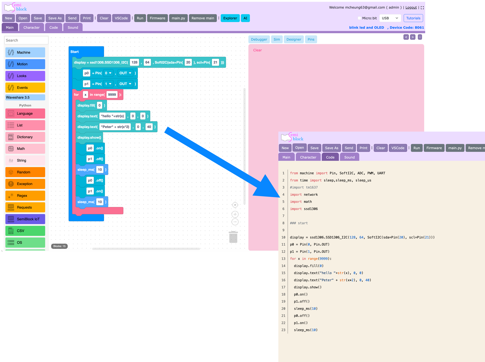

Welcome to **SemiBlock MicroPython** — a friendly, visual way to program real microcontrollers without typing a single line of code (unless you want to!).

If you have never written a program before, you are in exactly the right place. This guide starts from zero and walks you all the way to blinking a real LED on an ESP32 board.

Author: Chan Sir

## What you will build

By the end of **Part I — Getting Started** you will be able to:

- Understand what SemiBlock and MicroPython are.
- Prepare an ESP32-class board and flash MicroPython firmware onto it.
- Open the SemiBlock editor and snap blocks together.
- Watch the editor turn your blocks into real Python code.
- Upload that code and run it on your board.

## How SemiBlock works (the big picture)

SemiBlock is a **block editor**. You drag colorful puzzle-piece blocks from a toolbox on the left and connect them in the middle of the screen. As you build, SemiBlock automatically writes the matching **MicroPython** program for you.

{width=100%}

You did not type that — the blocks did. The code is real, runnable MicroPython.

## Who this guide is for

- Absolute beginners who have never coded.
- Students, makers, and teachers exploring electronics.
- Anyone who wants results fast, then wants to learn the code underneath.

You do **not** need to know Python first. You will pick it up naturally by
seeing the code each block produces.

## What you need

- A computer (macOS, Windows, or Linux).
- A USB cable.
- An ESP32, ESP32-S3, or compatible board (we cover boards next).

## Try it yourself

Before reading on, look at the code block above and guess: which line do you think turns the LED *on*? Keep your guess in mind — you will confirm it in the [first program](first-program.md) chapter.

## Next

Continue to [What is SemiBlock?](what-is-semiblock.md)
