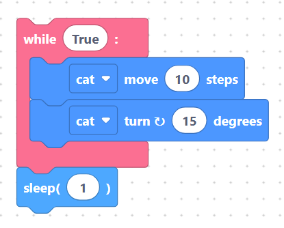

# Built-in simulator

You don't always have a board plugged in — and sometimes you just want to try an
idea quickly. SemiBlock includes a **built-in simulator** so you can run certain
programs right in the browser, no hardware required.

## What the simulator is for

The simulator runs a **sprite-style** visual program. It's perfect for learning
program flow — loops, events, and motion — before you wire up real electronics.
It complements the hardware path rather than replacing it.

## The blocks that drive it

Three toolbox categories (above the **Python** separator) feed the simulator:

#### **Motion** (move, turn, glide, go to X/Y, point in a direction).

> {width=inherit}

#### **Looks** (show, hide, switch costume, set size).

> {width=inherit}

#### **Events** (react to things like *when clicked*).

> {width=inherit}

Drag these blocks together to make a sprite move and respond.

## Two generators behind the scenes

SemiBlock actually has more than one code generator. Alongside the main
MicroPython generator, it ships dedicated simulator generators:

- `generators/simulator.js` — drives the visual sprite simulator.
- `generators/micropythonSimulator.js` — a MicroPython-flavored simulation path.

The editor registers all of them at startup, so the same blocks can target real
hardware **or** the simulator depending on the generator in use.

## A simple simulated program

Here's the kind of logic the simulator handles — move a sprite in a loop:

```text
when clicked
repeat forever:
    move 10 steps
    turn right 15 degrees
    wait 1 second
```

The equivalent MicroPython-style pseudocode the hardware generator would produce
for a loop looks familiar:

```python
while True:
    move(10)
    turn_right(15)
    time.sleep(1)
```

> 

The simulator interprets the motion blocks visually instead of sending them to a
chip.

## When to use the simulator vs. the board

| Goal                         | Use            |
| ---------------------------- | -------------- |
| Learn loops and events       | Simulator      |
| Test logic without hardware  | Simulator      |
| Blink a real LED             | ESP32 board    |
| Read a real sensor           | ESP32 board    |

## How it fits your workflow

1. Prototype the **flow** of your program with simulator blocks.
2. Once the logic feels right, switch to **Hardware Blocks** for the real board.
3. Generate MicroPython, upload, and run as you did in
   [Uploading and running](upload-run.md).

## Try it yourself

Open the **Events** category and drag in a *when clicked* block. Add a couple of
**Motion** blocks beneath it (for example *move* and *turn right*). Run the
simulator and watch the sprite respond — all without touching a board.

## Next

[Language Category](../language/index.md)
