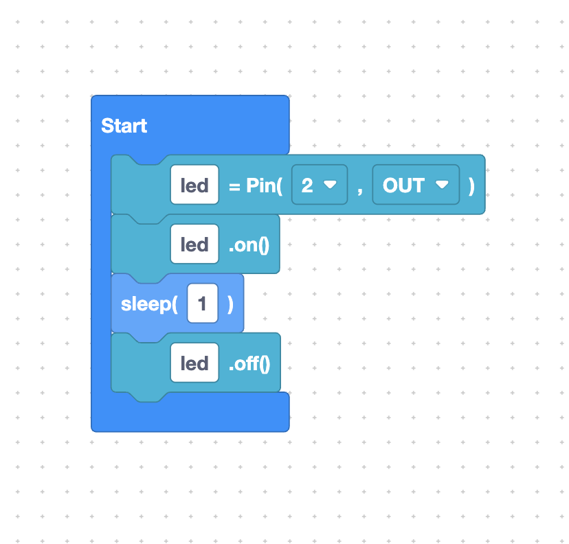

# What is MicroPython?

**MicroPython** is a small, fast version of the Python programming language that runs directly on microcontrollers — tiny computers like the ESP32 that fit in the palm of your hand.

SemiBlock generates MicroPython code, so understanding MicroPython helps you read and trust what your blocks produce.

## Python, shrunk to fit a chip

Regular Python runs on laptops and servers. MicroPython is a re-implementation designed to run on devices with very little memory. It keeps the friendly Python syntax you may have heard about, but adds special modules for hardware.

The most important one is `machine`, which lets your code touch real pins, buses, and timers:



```python
from machine import Pin
from time import sleep

led = Pin(2, Pin.OUT)
led.on()
sleep(1)
led.off()
```

That is a complete, real MicroPython program that blinks an LED once.

## Why MicroPython for microcontrollers?

- **Interactive.** You can talk to the board live over a serial connection.
- **Readable.** Python is one of the easiest languages to read.
- **Hardware-aware.** Built-in modules (`machine`, `network`, `time`) control
  GPIO, Wi-Fi, and timing.
- **No compiling.** You send `.py` text to the board and it runs.

## The pieces you will meet

| MicroPython piece | What it does |
|-------------------|--------------|
| `machine.Pin`     | Read or control a GPIO pin |
| `time.sleep`      | Pause the program for seconds |
| `network`         | Connect to Wi-Fi |
| `ADC`, `PWM`      | Read analog values / control brightness, motors |

SemiBlock has blocks for all of these, so you rarely type them by hand.

## Firmware vs. your program

There are two layers on your board:

1. **MicroPython firmware** — the interpreter itself. You install this once.
   We do that in [Flash firmware](flash-firmware.md).
2. **Your program** — the `.py` code SemiBlock generates. You upload this often,
   every time you change your blocks.

## Try it yourself

Read the code block above out loud, line by line, in plain English. ("Make a pin called led... turn it on... wait one second... turn it off.") Notice how close MicroPython already is to ordinary language.

## Next

Continue to [Supported boards](supported-boards.md)
