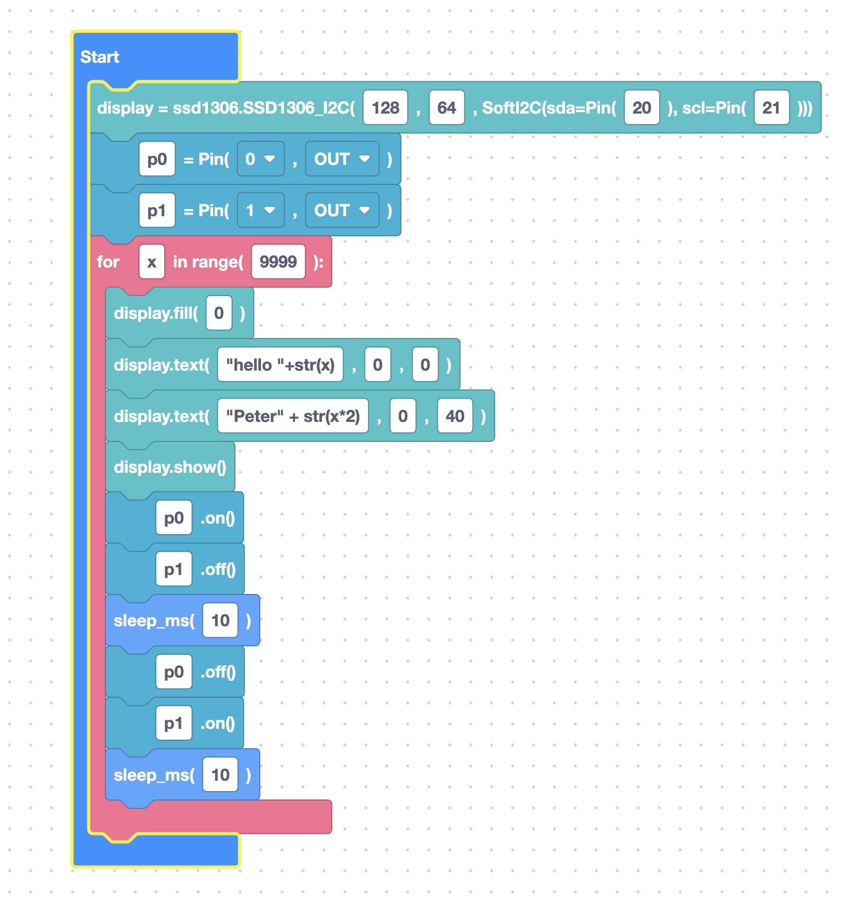

# What is SemiBlock?

**SemiBlock** is a visual, block-based programming editor. Instead of typing text, you build programs by connecting blocks — like snapping together puzzle pieces. SemiBlock then generates clean **MicroPython** code from those blocks.

It is built on top of **Blockly**, the same open-source block engine used by many educational coding tools, and it is tuned specifically for programming microcontrollers.

## Blocks instead of typing

Each block represents one small idea:

- A block to create a pin.
- A block to turn that pin on.
- A block to wait for one second.

Snap those together and you have a working program. Because the blocks only fit in valid ways, it is very hard to make a "syntax error" — a huge advantage when you are just starting out.



## You still get real code

SemiBlock is not a toy. Every block maps to actual MicroPython. As you build, the generated program appears next to your blocks:

```python
from machine import Pin, SoftI2C, ADC, PWM, UART
from time import sleep, sleep_ms, sleep_us

### start

led = Pin(2, Pin.OUT)
led.on()
sleep(1)
led.off()
```

This means SemiBlock is also a great way to **learn Python**: build with blocks, then read the code they produce.

## A toolbox full of hardware

The block toolbox is organized into categories. Some are familiar programming ideas (Math, List, Loops), and many are about real hardware:

- **Machine** — reset the board, sleep, connect Wi-Fi.
- **Pin** — control GPIO pins (turn LEDs and outputs on/off).
- **PWM**, **ADC**, **I2C**, **SPI**, **Timer** — talk to sensors and devices.
- **Sensors** and **Generative AI** — higher-level building blocks.

We tour the whole toolbox later in [Toolbox tour](toolbox-tour.md).

## Where it runs

SemiBlock runs in your **web browser**. There is nothing heavy to install just to use the editor — you open a page, drag blocks, and copy the generated code to your board. Your work is even saved automatically in the browser.

## Try it yourself

Think of an everyday gadget — a blinking bike light, a doorbell, a thermometer. Can you imagine it as a few small steps? That list of steps is basically a block program waiting to be built.

## Next

Continue to [What is MicroPython?](what-is-micropython.md)
