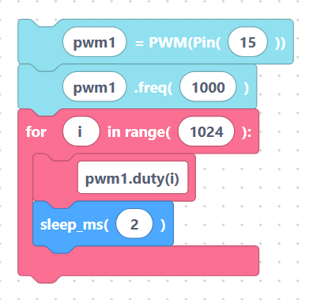

# [Wait Until Bugs Fixed] Worked example: fade an LED

This example smoothly fades an LED brighter and brighter by sweeping the PWM
**duty cycle** from `0` up to `1023` inside a loop. It combines blocks from the
PWM category with a `for` loop and a `sleep_ms` delay.

## The blocks

1. `pwmInit` — attach PWM to the LED pin.
2. `pwmSetFreq` — pick a steady 1000 Hz.
3. A **for loop** counting `i` from `0` to `1023`.
4. Inside the loop: `pwmSetDuty` using `i`, then `sleep_ms` for a short pause.

## Generated MicroPython

```python
pwm1 = PWM(Pin(15))
pwm1.freq(1000)
for i in range(1024):
	pwm1.duty(i)
	sleep_ms(2)
```

> {width=inherit}

## How it works

- `range(1024)` produces the numbers `0, 1, 2, … 1023`.
- Each pass sets the duty to `i`, so the LED gets a little brighter every step.
- `sleep_ms(2)` slows the sweep so your eye can see the fade (about 2 seconds
  for a full pass).

## Make it pulse

To fade *down* as well, add a second loop that counts back down. The duty field
accepts any expression you type, so `1023 - i` works:

```python
for i in range(1024):
	pwm1.duty(1023 - i)
	sleep_ms(2)
```

Place the up-sweep and down-sweep inside a `while True:` loop to make the LED
"breathe" forever.

## Wiring notes

- GPIO 15 → resistor (≈330 Ω) → LED anode (long leg); LED cathode → GND.
- Any PWM-capable output pin works — change the number in `pwmInit`.

## Next

Continue to **[ADC & DAC overview »](../adc/index.md)**
