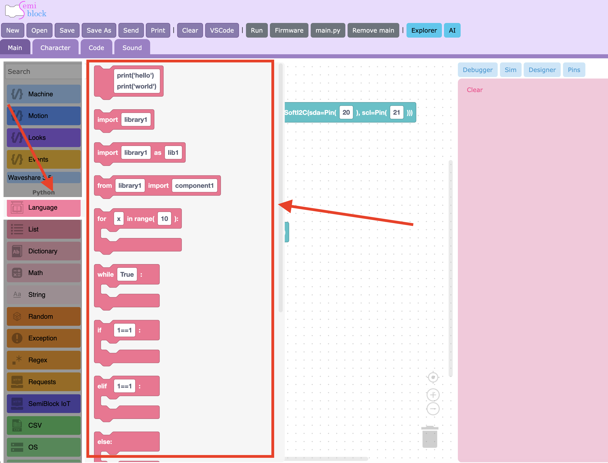
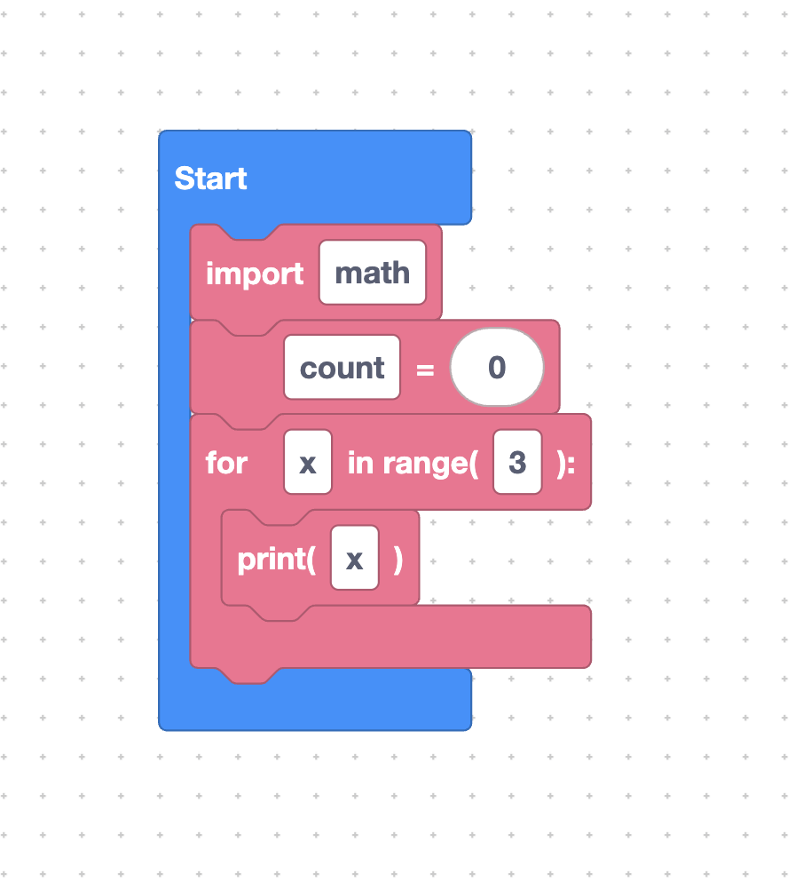

# Language Category

The **Language** category holds the core building blocks of every MicroPython program: imports, loops, conditions, printing, variables, functions, and more. These are the same blocks you reach for no matter which board or sensor you use.

Every block in this category shares the same pink colour (`#fb6f92`) so you can spot them quickly in the toolbox.

## What you will learn

- [Free code blocks](free-code.md) — type raw MicroPython when no block exists.
- [`import` and `from … import`](imports.md) — load extra modules.
- [`for` loops](for-loop.md) — repeat a fixed number of times.
- [`while` loops](while-loop.md) — repeat while a condition is true.
- [`if` / `elif` / `else`](if-else.md) — make decisions.
- [`print` and comments](print-comment.md) — show output and add notes.
- [`pass` statement](pass.md) — a do-nothing placeholder.
- [Variables](variables.md) — store a value under a name.
- [Defining functions (`def`)](def.md) — group reusable code.
- [Threads (`startThread`)](threads.md) — run code in the background.



## A quick taste

A few language blocks snapped together already make a real program:



```python
import math

count = 0
for x in range(3):
	print(x)
```

The `import` block, the variable block, the `for` loop, and the `print` block each contributed one line. The rest of this section explains them one by one.

## Next

Continue to [Free code blocks](free-code.md)
