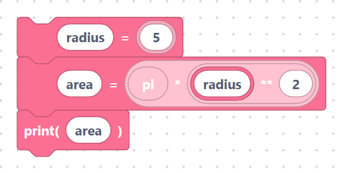
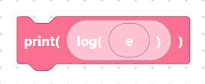

# Constants: `pi`, `e`

Two famous mathematical constants are available as ready-made **value blocks**.
Both come from the `math` module, which SemiBlock imports for you automatically.

## The `mathPi` block

- **Label:** `pi`
- **Inputs:** none.

Gives the value of π (about `3.14159`):

```python
math.pi
```

> {width=inherit}

## The `mathE` block

- **Label:** `e`
- **Inputs:** none.

Gives Euler's number *e* (about `2.71828`):

```python
math.e
```

> {width=inherit}

## Worked example

Use `pi` to find the area of a circle:

```python
radius = 5
area = math.pi * radius ** 2
print(area)
```

> {width=inherit}

Or use `e` with the [`log`](functions.md) block, which is its natural partner:

```python
print(math.log(math.e))
```

> {width=inherit}

This prints `1.0`, because the natural logarithm of *e* is exactly 1.

## Next

Continue to [`random`, `randint`, `divmod`, `hex`, `ord`](misc.md)
