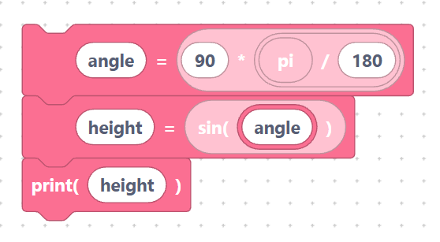

# `sqrt`, `sin`, `cos`, `tan`, `log`, `exp`

> {width=inherit}

These scientific functions come from MicroPython's `math` module. SemiBlock
already adds `import math` at the top of your program, so they are ready to use.
Each is a **value block** that returns a result.

## The `mathSqrt` block

- **Label:** `sqrt(%1)` — input `A` (default `0`). Square root.

```python
math.sqrt(0)
```

> {width=inherit}

## The `mathSin` block

- **Label:** `sin(%1)` — input `A`. Sine (angle in **radians**).

```python
math.sin(0)
```

> {width=inherit}

## The `mathCos` block

- **Label:** `cos(%1)` — input `A`. Cosine (radians).

```python
math.cos(0)
```

> {width=inherit}

## The `mathTan` block

- **Label:** `tan(%1)` — input `A`. Tangent (radians).

```python
math.tan(0)
```

> {width=inherit}

## The `mathLog` block

- **Label:** `log(%1)` — input `A`. Natural logarithm (base *e*).

```python
math.log(0)
```

> {width=inherit}

## The `mathExp` block

- **Label:** `exp(%1)` — input `A`. *e* raised to the power `A`.

```python
math.exp(0)
```

> {width=inherit}

## Worked example

Combine with the [`pi` constant](constants.md) to work in degrees:

```python
angle = 90 * (math.pi / 180)
height = math.sin(angle)
print(height)
```

> {width=inherit}

> Tip: trig blocks expect **radians**. Multiply degrees by `math.pi / 180` to
> convert.

## Next

Continue to [`abs`, `floor`, `ceil`, `round`, `min`, `max`](rounding.md)
