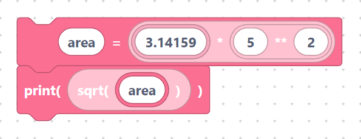

# Math

> {width=inherit}

The **Math** category gives you number blocks: arithmetic, scientific functions,
rounding, constants, and a few handy extras. Most of them are **value blocks** —
they produce a result you plug into a variable, a `print`, or another math block.

SemiBlock already adds `import math` at the top of every program, so the `math.*`
blocks work out of the box. The random helpers need `import random` (see below).

## What you will learn

- [Integers, add / subtract / multiply / divide / modulo / power](arithmetic.md)
- [`sqrt`, `sin`, `cos`, `tan`, `log`, `exp`](functions.md)
- [`abs`, `floor`, `ceil`, `round`, `min`, `max`](rounding.md)
- [Constants: `pi`, `e`](constants.md)
- [`random`, `randint`, `divmod`, `hex`, `ord`](misc.md)

## A quick taste

Math blocks nest inside one another and inside variable blocks:

```python
area = 3.14159 * 5 ** 2
print(math.sqrt(area))
```

> {width=inherit}

Here a power block (`5 ** 2`), a multiply block, and a `sqrt` block work
together. The next pages explain each one.

## Next

Continue to [Arithmetic](arithmetic.md)
