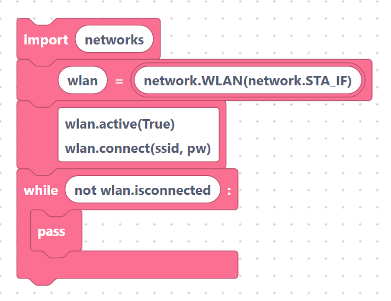

# HTTP Requests

The **Requests** category lets your ESP32 talk to web servers using the
MicroPython `urequests` module. With it you can read data from an API, send
readings to a server, or trigger a webhook — all from blocks.

## Wi-Fi is required

HTTP only works once the board is on a network. SemiBlock always puts
`import network` at the top of the generated program, so you just need to bring
the connection up before any request block runs:

```python
import network
wlan = network.WLAN(network.STA_IF)
wlan.active(True)
wlan.connect(ssid, pw)        # replace ssid / pw with your network + password
while not wlan.isconnected():
    pass
```

> {width=inherit}

> `import urequests` is added for you automatically as soon as any request
> block (or a SemiBlock IoT block) is on the workspace — you do not import it
> yourself.

## What you will learn

- [`GET`, `POST`, `PUT`, `DELETE`, `HEAD`](methods.md) — the five request blocks
  and the exact code each one emits.
- [Sending JSON and headers](json-headers.md) — putting a JSON body in a
  request and reading a reply with `.json()`.

## A quick taste

A GET request block where the URL field contains `"http://example.com"`:

```python
urequests.get("http://example.com")
```

> {width=inherit}

> Fields are inserted **verbatim**, so type the quotes around your URL.

## Next

Continue to [`GET`, `POST`, `PUT`, `DELETE`, `HEAD`](methods.md)
