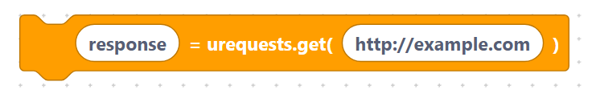
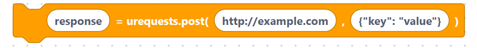
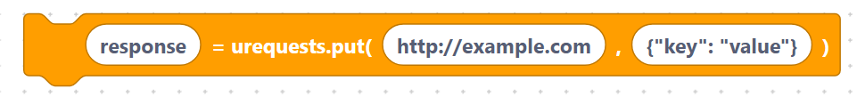
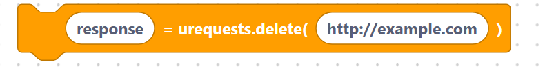
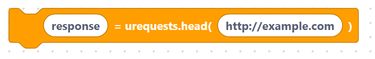
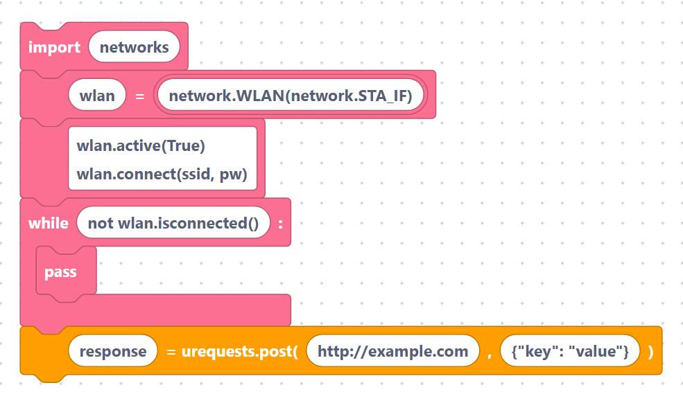

# `GET`, `POST`, `PUT`, `DELETE`, `HEAD`

These five blocks call the matching `urequests` functions. The **URL** and
**data** fields are inserted **verbatim**, so quote the URL yourself
(e.g. `"http://example.com"`).

> Note: the block shows `response = urequests.get(...)`, but the current
> generator emits only the call — it does **not** add the `response =`
> assignment. See [Sending JSON and headers](json-headers.md) for how to capture
> a reply.

## `urequestsGet`

- **Description:** send a GET request (read data).
- **Inputs:** `url` (default `http://example.com`).

```python
urequests.get(http://example.com)
```

> {width=inherit}

With a quoted URL field (`"http://example.com"`):

```python
urequests.get("http://example.com")
```

> {width=inherit}

## `urequestsPost`

- **Description:** send a POST request with a body.
- **Inputs:** `url` (default `http://example.com`), `data` (default
  `{"key": "value"}`).

```python
urequests.post(http://example.com, data={"key": "value"})
```

> {width=inherit}

## `urequestsPut`

- **Description:** send a PUT request with a body.
- **Inputs:** `url`, `data` (default `{"key": "value"}`).

```python
urequests.put(http://example.com, data={"key": "value"})
```

> {width=inherit}

## `urequestsDelete`

- **Description:** send a DELETE request.
- **Inputs:** `url` (default `http://example.com`).

```python
urequests.delete(http://example.com)
```

> {width=inherit}

## `urequestsHead`

- **Description:** send a HEAD request (headers only, no body).
- **Inputs:** `url` (default `http://example.com`).

```python
urequests.head(http://example.com)
```

> {width=inherit}

## Worked example

Send a POST with a quoted URL and a small JSON-style body:

```python
import network
wlan = network.WLAN(network.STA_IF)
wlan.active(True)
wlan.connect(ssid, pw)
while not wlan.isconnected():
    pass

urequests.post("http://example.com/api", data={"key": "value"})
```

> {width=inherit}

> Remember: `import urequests` is injected automatically when a request block is
> present.

## Next

Continue to [Sending JSON and headers](json-headers.md)
