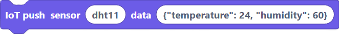
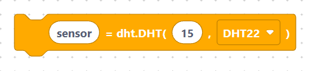
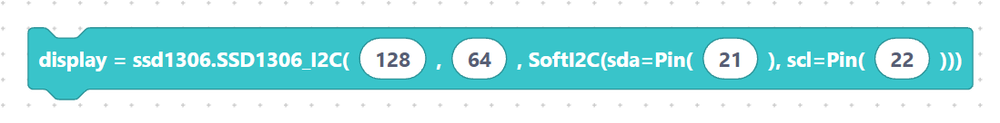
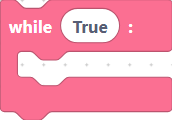
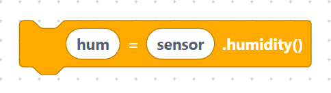

# Project: Weather Station (DHT + OLED + IoT push)

Read temperature and humidity from a **DHT** sensor, show them on an **SSD1306
OLED**, and push every reading to the **SemiBlock IoT** cloud so you can graph
them in a browser.

## What you'll build

- A **DHT22** (or DHT11) sensor measuring temperature (°C) and humidity (%).
- A **128×64 OLED** that prints both values, refreshed every few seconds.
- An **IoT push** that uploads each reading to your SemiBlock dashboard.

## Parts needed / wiring

| Part | Connect to ESP32 |
| --- | --- |
| DHT22 data | GPIO **15** |
| OLED SDA | GPIO **21** |
| OLED SCL | GPIO **22** |
| Both modules | 3V3 + GND |

## Blocks used (which categories)

- **Sensors → DHT**: `dhtInit`, `dhtReadTemperature`, `dhtReadHumidity` — see
  [../sensors/dht.md](../sensors/dht.md).

> {width=inherit} {width=inherit} {width=inherit}

- **Display → SSD1306**: `ssd1306`, `ssd1306_fill`, `ssd1306_text`,
  `ssd1306_show` — see [../display/ssd1306/index.md](../display/ssd1306/index.md)
  and [../display/ssd1306/setup.md](../display/ssd1306/setup.md).

> {width=inherit} {width=inherit} {width=inherit} {width=inherit}

- **Network**: `connectWifi` to join Wi-Fi before uploading.

> {width=inherit}

- **IoT**: `iotConnect`, `iotPushValue` — see
  [../iot/connect.md](../iot/connect.md) and [../iot/push.md](../iot/push.md).

> {width=inherit} {width=inherit}

## Step-by-step block assembly

1. Add **`connect WiFi`** with your SSID and password (needed for the upload).

> {width=inherit}

2. From **IoT**, drag **`iot connect`** and fill in your server, device id, and
   secret from the SemiBlock dashboard.

> {width=inherit}

3. From **DHT**, add **`init DHT22 sensor on pin 15`**.

> {width=inherit}

4. From **SSD1306**, add **`OLED 128 x 64 sda 21 scl 22`**.

> {width=inherit}

5. Start a forever **`while True`** loop.

> {width=inherit}

6. Inside: **`read DHT22 sensor temperature into temp`**, then
   **`read DHT22 sensor humidity into hum`**.

> {width=inherit} {width=inherit}

1. Clear the screen with **`fill 0`**, then two **`text`** blocks for temp and
   humidity, then **`show`**.
2. Add two **`iot push value`** blocks (one for temp, one for humidity).
3.  End the loop with **`sleep 5`** seconds.

## Full generated MicroPython

```python
from machine import Pin, SoftI2C, ADC, PWM, UART
from time import sleep, sleep_ms, sleep_us
import network
import math
import ssd1306

import dht

import urequests

### start

connectWifi("MyWiFi", "MyPassword")
IOT_SERVER = "https://iot.semiblock.com"
IOT_DEVICE_ID = "esp32-weather"
IOT_SECRET = "your-secret-key"
sensor = dht.DHT22(Pin(15))
display = ssd1306.SSD1306_I2C(128, 64, SoftI2C(sda=Pin(21), scl=Pin(22)))
while True:
    sensor.measure()
    temp = sensor.temperature()
    sensor.measure()
    hum = sensor.humidity()
    display.fill(0)
    display.text("Temp: " + str(temp) + " C", 0, 0)
    display.text("Hum:  " + str(hum) + " %", 0, 16)
    display.show()
    urequests.post(IOT_SERVER + "/iot/data", json={"device_id": IOT_DEVICE_ID, "secret_key": IOT_SECRET, "sensor_type": "weather", "data": {"temp": temp}})
    urequests.post(IOT_SERVER + "/iot/data", json={"device_id": IOT_DEVICE_ID, "secret_key": IOT_SECRET, "sensor_type": "weather", "data": {"humidity": hum}})
    sleep(5)
```

> `import ssd1306`, `import dht`, and `import urequests` are added automatically
> because the program uses those blocks. The `iot push value` block emits the
> exact `urequests.post(... "/iot/data" ...)` call shown.

## How to run

1. Open the SemiBlock dashboard, create a device, and copy its **device id** and
   **secret** into the `iot connect` block.
2. Build the blocks, press **Run**, and confirm the OLED shows two lines.
3. Open the device page on the dashboard — new temperature and humidity points
   should appear every 5 seconds. See
   [../iot/dashboard.md](../iot/dashboard.md).
4. No data online? Check Wi-Fi first — see
   [../reference/trouble-wifi.md](../reference/trouble-wifi.md).

## Extensions / challenges

- **Comfort indicator:** print "Too dry" / "Just right" based on humidity.
- **Min/max tracking:** keep variables for the day's highest and lowest temp.
- **Batch uploads:** push once per minute instead of every reading to save data.
- **Add a heat index:** compute apparent temperature from temp + humidity with
  `math` and show it as a third line.

---

**Next:** [Project: Distance Alarm (HC-SR04 + NeoPixel)](distance-alarm.md)
