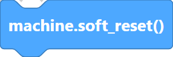
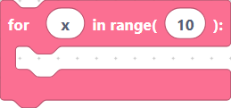
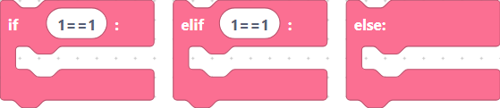
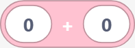
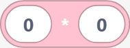
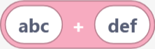
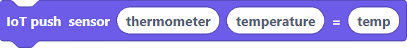

# Block ↔ MicroPython code mapping

This table shows a representative block from each category alongside the MicroPython
code it generates. The output is pulled directly from `src/generators/micropython.js`
(field placeholders such as `var_name`, `pinNo`, etc. are shown as their literal
field names). Most blocks generate a single line; a few (DHT, HC-SR04, CSV, IoT)
emit several lines or pull in a driver class.

## Core / Machine

> {width=inherit}

| Image | Block `type` | Generated MicroPython |
| --- | --- | --- |
| `No Image` | `createMainMethod` | Emits the standard header (`from machine import Pin, SoftI2C, ADC, PWM, UART`, `from time import sleep, sleep_ms, sleep_us`, `import network`, `import math`, …) followed by a `### start` marker and the body. Extra imports (`neopixel`, `ssd1306`, `_thread`, `servo`, `dht`, `sprite`, `urequests`) are added on demand. |
| {width=inherit} | `softReset` | `machine.soft_reset()` |
| {width=inherit} | `hardReset` | `machine.reset()` |
| {width=inherit} | `sleep` | `sleep(time)` |
| {width=inherit} | `sleep_ms` | `sleep_ms(time)` |
| {width=inherit} | `connectWifi` | `connectWifi("ssid", "password")` |
| {width=inherit} | `mem32Read` | `var_name = machine.mem32(address)` |
| {width=inherit} | `getCPUFreq` | `var_name = machine.freq()` |

## Language

> {width=inherit}

| Image | Block `type` | Generated MicroPython |
| --- | --- | --- |
| {width=inherit} | `print` | `print(value)` |
| {width=inherit} | `variable` | `var_name = <statements>` |
| {width=inherit} | `comment` | `# comment` |
| {width=inherit} | `pass` | `pass` |
| {width=inherit} | `def` | `def funcName(parameters):` + indented body |
| {width=inherit} | `forLoop` | `for var1 in range(var2):` + indented body |
| {width=inherit} | `whileLoop` | `while conditions:` + indented body |
| {width=inherit} | `ifLoop` | `if conditions:` + indented body |
| {width=inherit} | `importCode` | `import libraryName` |
| {width=inherit} | `fromImportCode` | `from libraryName import component` |
| {width=inherit} | `startThread` | `varName = _thread.start_new_thread(funcName, ())` |

## Math

> {width=inherit}

| Image | Block `type` | Generated MicroPython |
| --- | --- | --- |
| {width=inherit} | `mathNumber` | `value` |
| {width=inherit} | `mathAdd` | `A + B` |
| {width=inherit} | `mathSubtract` | `A - B` |
| {width=inherit} | `mathMultiply` | `A * B` |
| {width=inherit} | `mathDivide` | `A / B` |
| {width=inherit} | `mathModulo` | `A % B` |
| {width=inherit} | `mathPower` | `A ** B` |
| {width=inherit} | `mathSqrt` | `math.sqrt(A)` |
| {width=inherit} | `mathSin` | `math.sin(A)` |
| {width=inherit} | `mathCos` | `math.cos(A)` |
| {width=inherit} | `mathTan` | `math.tan(A)` |
| {width=inherit} | `mathLog` | `math.log(A)` |
| {width=inherit} | `mathExp` | `math.exp(A)` |
| {width=inherit} | `mathAbs` | `abs(A)` |
| {width=inherit} | `mathFloor` | `math.floor(A)` |
| {width=inherit} | `mathCeil` | `math.ceil(A)` |
| {width=inherit} | `mathRound` | `round(A)` |
| {width=inherit} | `mathMin` | `min(A, B)` |
| {width=inherit} | `mathMax` | `max(A, B)` |
| {width=inherit} | `mathPi` | `math.pi` |
| {width=inherit} | `mathE` | `math.e` |
| {width=inherit} | `mathRandom` | `random.random()` |
| {width=inherit} | `mathRandint` | `random.randint(A, B)` |
| {width=inherit} | `mathDivmod` | `divmod(A, B)` |
| {width=inherit} | `mathHex` | `hex(A)` |
| {width=inherit} | `mathOrd` | `ord(A)` |

## String

> {width=inherit}

| Image | Block `type` | Generated MicroPython |
| --- | --- | --- |
| {width=inherit} | `stringText` | `'text'` |
| {width=inherit} | `stringUpper` | `text.upper()` |
| {width=inherit} | `stringLower` | `TEXT.lower()` |
| {width=inherit} | `stringStrip` | `text.strip()` |
| {width=inherit} | `stringReplace` | `text.replace('t', 'T')` |
| {width=inherit} | `stringFind` | `text.find('t')` |
| {width=inherit} | `stringSplit` | `'a,b,c'.split(',')` |
| {width=inherit} | `stringJoin` | `','.join(['a', 'b', 'c'])` |
| {width=inherit} | `stringStartswith` | `text.startswith('t')` |
| {width=inherit} | `stringEndswith` | `text.endswith('t')` |
| {width=inherit} | `stringLen` | `len(text)` |
| {width=inherit} | `stringInsertNewlineEveryNChars` | `'\n'.join([s[i:i+4] for i in range(0, len(s), 4)])` |
| {width=inherit} | `stringAdd` | `'abc' + 'def'` |

## List

> {width=inherit}

| Image | Block `type` | Generated MicroPython |
| --- | --- | --- |
| {width=inherit} | `listInit` | `list1 = [20, 50, 30]` |
| {width=inherit} | `listAppend` | `list1.append(10)` |
| {width=inherit} | `listInsert` | `list1.insert(0, 10)` |
| {width=inherit} | `listRemove` | `list1.remove(10)` |
| {width=inherit} | `listPop` | `list1.pop(-1)` |
| {width=inherit} | `listSort` | `list1.sort()` |
| {width=inherit} | `listReverse` | `list1.reverse()` |
| {width=inherit} | `listLen` | `length = len(list1)` |
| {width=inherit} | `listItem` | `item = list1[0]` |
| {width=inherit} | `listSliceStartEnd` | `slice = list1[0:2]` |
| {width=inherit} | `listSliceEnd` | `slice = list1[:2]` |
| {width=inherit} | `listSliceStart` | `slice = list1[0:]` |
| {width=inherit} | `listSliceCopy` | `slice = list1[:]` |

## Dictionary

> {width=inherit}

| Image | Block `type` | Generated MicroPython |
| --- | --- | --- |
| {width=inherit} | `dictInit` | `dict1 = {}` |
| {width=inherit} | `dictSet` | `dict1['key1'] = value1` |
| {width=inherit} | `dictGet` | `value = dict1['key1']` |
| {width=inherit} | `dictKeys` | `keys = dict1.keys()` |
| {width=inherit} | `dictValues` | `values = dict1.values()` |
| {width=inherit} | `dictItems` | `items = dict1.items()` |
| {width=inherit} | `dictPop` | `value = dict1.pop('key1')` |
| {width=inherit} | `dictUpdate` | `dict1.update(dict2)` |
| {width=inherit} | `dictClear` | `dict1.clear()` |

## Random

> {width=inherit}

| Image | Block `type` | Generated MicroPython |
| --- | --- | --- |
| {width=inherit} | `randomRandom` | `random.random()` |
| {width=inherit} | `randomRandint` | `random.randint(A, B)` |
| {width=inherit} | `randomChoice` | `random.choice(A)` |
| {width=inherit} | `randomShuffle` | `random.shuffle(A)` |
| {width=inherit} | `randomUniform` | `random.uniform(A, B)` |
| {width=inherit} | `randomRandrange` | `random.randrange(A, B, C)` |
| {width=inherit} | `randomSample` | `random.sample(A, B)` |

## Regex / Requests

> {width=inherit} {width=inherit}

| Image | Block `type` | Generated MicroPython |
| --- | --- | --- |
| {width=inherit} | `reMatch` | `result = re.match(pattern, string)` |
| {width=inherit} | `reSearch` | `result = re.search(pattern, string)` |
| {width=inherit} | `reFindall` | `result = re.findall(pattern, string)` |
| {width=inherit} | `reFinditer` | `result = re.finditer(pattern, string)` |
| {width=inherit} | `reSub` | `result = re.sub(pattern, replacement, string)` |
| {width=inherit} | `reSplit` | `result = re.split(pattern, string)` |
| {width=inherit} | `reCompile` | `compiled_pattern = re.compile(pattern)` |
| {width=inherit} | `urequestsGet` | `response = urequests.get('http://example.com')` |
| {width=inherit} | `urequestsJson` | `data = response.json()` |
| {width=inherit} | `urequestsPost` | `response = urequests.post('http://example.com', {"key": "value"})` |
| {width=inherit} | `urequestsPut` | `response = urequests.put('http://example.com', {"key": "value"})` |
| {width=inherit} | `urequestsDelete` | `response = urequests.delete('http://example.com')` |
| {width=inherit} | `urequestsHead` | `response = urequests.head('http://example.com')` |

## SemiBlock IoT

> {width=inherit}

| Image | Block `type` | Generated MicroPython |
| --- | --- | --- |
| {width=inherit} | `iotConnect` | `IOT_SERVER = "https://build.semiblock.ai"` / `IOT_DEVICE_ID = "device_id"` / `IOT_SECRET = "secret"` |
| {width=inherit} | `iotPushReading` | `urequests.post(IOT_SERVER + "/iot/data", json={"device_id": IOT_DEVICE_ID, "secret_key": IOT_SECRET, "sensor_type": "dht11", "data": {"temperature": 24, "humidity": 60}})` |
| {width=inherit} | `iotPushSingleValue` | `urequests.post(IOT_SERVER + "/iot/data", json={"device_id": IOT_DEVICE_ID, "secret_key": IOT_SECRET, "sensor_type": "thermometer", "data": {"temperature": temp}})` |

## OS / CSV

> {width=inherit} {width=inherit}

| Image | Block `type` | Generated MicroPython |
| --- | --- | --- |
| {width=inherit} | `csvRead` | `data = read_csv('file.csv')` |
| {width=inherit} | `csvWrite` | `write_csv('file.csv', [["col1", "col2"], ["val1", "val2"]])` |
| {width=inherit} | `csvAppend` | `append_csv('file.csv', ["val1", "val2"])` |
| {width=inherit} | `osListdir` | `os.listdir('/')` |
| {width=inherit} | `osRemove` | `os.remove('/file.txt')` |
| {width=inherit} | `osRename` | `os.rename('/old.txt', '/new.txt')` |
| {width=inherit} | `osMkdir` | `os.mkdir('/new_folder')` |
| {width=inherit} | `osRmdir` | `os.rmdir('/folder')` |
| {width=inherit} | `osGetcwd` | `os.getcwd()` |
| {width=inherit} | `osChdir` | `os.chdir('/new_folder')` |
| {width=inherit} | `osStat` | `os.stat('/file.txt')` |
| {width=inherit} | `osUname` | `os.uname()` |
| {width=inherit} | `osSync` | `os.sync()` |
| {width=inherit} | `osSystem` | `os.system('ls')` |
| {width=inherit} | `osUrandom` | `os.urandom(16)` |

## Display (SSD1306)

> {width=inherit}

| Image | Block `type` | Generated MicroPython |
| --- | --- | --- |
| {width=inherit} | `ssd1306` | `display = ssd1306.SSD1306_I2C(128, 64, SoftI2C(sda=Pin(10), scl=Pin(10)))` |
| {width=inherit} | `ssd1306_fill` | `display.fill(0)` |
| {width=inherit} | `ssd1306_show` | `display.show()` |
| {width=inherit} | `ssd1306_contrast` | `display.contrast(255)` |
| {width=inherit} | `ssd1306_invert` | `display.invert(0)` |
| {width=inherit} | `ssd1306_rotate` | `display.rotate(True)` |
| {width=inherit} | `ssd1306_text` | `display.text("Helloworld", 0, 0)` |
| {width=inherit} | `ssd1306_pixel` | `display.pixel(0, 0, 1)` |
| {width=inherit} | `ssd1306_hline` | `display.hline(0, 0, 4, 1)` |
| {width=inherit} | `ssd1306_vline` | `display.vline(0, 0, 4, 1)` |
| {width=inherit} | `ssd1306_line` | `display.line(0, 0, 100, 100, 1)` |
| {width=inherit} | `ssd1306_rect` | `display.rect(0, 0, 100, 50, 1)` |
| {width=inherit} | `ssd1306_fill_rect` | `display.fill_rect(0, 0, 100, 50, 1)` |
| {width=inherit} | `ssd1306_circle` | `display.circle(64, 32, 10, 1)` |
| {width=inherit} | `ssd1306_fillCircle` | `display.fill_circle(64, 32, 10, 1)` |
| {width=inherit} | `ssd1306_scroll` | `display.scroll(10, 0)` |
| {width=inherit} | `display_create_image` | `image = bytearray([...])` |
| {width=inherit} | `display_draw_pixels` | `display.blit(image, 0, 0)` |
| {width=inherit} | `display_setColor` | `display.setColor('Red')` |
| {width=inherit} | `display_setFontSize` | `display.setFontSize(10)` |

## LVGL

| Block `type` | Generated MicroPython |
| --- | --- |
| `lvglInit` | `import lvgl as lv` |
| `lvglScreenCreate` | `screen_name = lv.obj()` |
| `lvglLabelCreate` | `label_name = lv.label(parent)` |
| `lvglLabelSetText` | `label_name.set_text("text")` |
| `lvglTaskHandler` | `lv.task_handler()` |

## Pin

> {width=inherit}

| Image | Block `type` | Generated MicroPython |
| --- | --- | --- |
| {width=inherit} | `pinInitOut` | `p0 = Pin(0, OUT)` |
| {width=inherit} | `pinInitIn` | `p0 = Pin(0, IN, PULL_UP)` |
| {width=inherit} | `pinOn` | `p0.on()` |
| {width=inherit} | `pinOff` | `p0.off()` |
| {width=inherit} | `pinValue` | `var1 = p0.value()` |
| {width=inherit} | `uartInit` | `var1 = UART(0, baudrate=9600, tx=16, rx=17)` |
| {width=inherit} | `uartRead` | `var1.read(8)` |
| {width=inherit} | `uartWrite` | `var1.write('hello')` |
| {width=inherit} | `neopixelInit` | `pixel = neopixel.NeoPixel(Pin(8, Pin.OUT), 1)` |
| {width=inherit} | `neopixelSetWrite` | `pixel[0] = (0xff, 0xff, 0xff)` `pixels.write()` |

## Timer / PWM / ADC

> {width=inherit} {width=inherit} {width=inherit}

| Image | Block `type` | Generated MicroPython |
| --- | --- | --- |
| {width=inherit} | `timerInit` | `timer1 = Timer(0)` |
| {width=inherit} | `timerConfig` | `timer1.init(period=1000, mode=Timer.ONE_SHOT, callback=callback_function)` |
| {width=inherit} | `timerDeinit` | `timer1.deinit()` |
| {width=inherit} | `pwmInit` | `pwm1 = PWM(Pin(15))` |
| {width=inherit} | `pwmFreq` | `pwm1.freq(1000)` |
| {width=inherit} | `pwmDuty` | `pwm1.duty(512)` |
| {width=inherit} | `pwmDeinit` | `pwm1.deinit()` |
| {width=inherit} | `adcInit` | `adc1 = ADC(Pin(32))` |
| {width=inherit} | `adcRead` | `value = adc1.read()` |
| {width=inherit} | `dacInit` | `dac1 = DAC(Pin(25))` |
| {width=inherit} | `dacWrite` | `dac1.write(128)` |

## SPI / I2C / One-Wire

| Block `type` | Generated MicroPython |
| --- | --- |
| `spiInit` | `var_name = SPI(spi_id, baudrate=…, polarity=…, phase=…, sck=Pin(sck), mosi=Pin(mosi), miso=Pin(miso))` |
| `i2cInit` | `var_name = I2C(i2c_id, scl=Pin(scl), sda=Pin(sda), freq=freq)` |
| `i2cScan` | `var_name = i2c_name.scan()` |
| `oneWireScan` | `var_name = ow_name.scan()` |

## Sensors

| Block `type` | Generated MicroPython |
| --- | --- |
| `temperature` | `var_name = getTemperature(D0, ADC)` |
| `servo` | `var_name = Servo(pin_number)` |
| `servoAngle` | `servo_Angle(var_name, angle)` |
| `motorOn` | `var_name (1)` |
| `dhtInit` | `var_name = dht.dht_type(Pin(pin))` |
| `dhtReadTemperature` | `dht_name.measure()` / `var_name = dht_name.temperature()` |
| `hcsr04Init` | Emits the full `HCSR04` driver class, then `var_name = HCSR04(trigger_pin=…, echo_pin=…, echo_timeout_us=…)` |
| `hcsr04DistanceCm` | `var_name = sonar_name.distance_cm()` |

## Generative AI / Open Data

| Block `type` | Generated MicroPython |
| --- | --- |
| `askDeepSeek` | `var_name = askDeepSeek("question")` |
| `getOpenDataTemperature` | `var_name = getOpenDataTemperature("location")` |
| `getBusArrivalTime` | `var_name = getBusArrivalTime(stopID, no)` |

---

**Next:** [Full block reference](blocks.md)

