# Full block reference (alphabetical)

Every block `type` available in the SemiBlock MicroPython toolbox, grouped by
category in the order the categories appear in `src/toolbox.js`. Within each
category the blocks are listed in toolbox order. Each entry has a one-line
description of what the block does.

## Machine

> 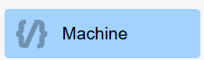{width=inherit}

| Image | Block `type` | Generated MicroPython |
| --- | --- | --- |
| {width=inherit} | `createMainMethod` | The program entry point; wraps imports and the `### start` body. |
| 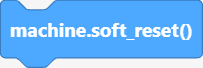{width=inherit} | `softReset` | `machine.soft_reset()` |
| 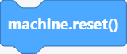{width=inherit} | `hardReset` | `machine.reset()` |
| {width=inherit} | `sleep` | `time.sleep(1)` |
| {width=inherit} | `sleep_ms` | `time.sleep_ms(1000)` |
| {width=inherit} | `sleep_us` | `time.sleep_us(1000)` |
| {width=inherit} | `connectWifi` | `connectWifi('SSID', 'PASSWORD')` |
| {width=inherit} | `mem8Read` | `machine.mem8[address]` |
| {width=inherit} | `mem16Read` | `machine.mem16[address]` |
| {width=inherit} | `mem32Read` | `machine.mem32[address]` |
| 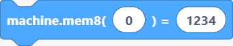{width=inherit} | `mem8Write` | `machine.mem8[address] = value` |
| {width=inherit} | `mem16Write` | `machine.mem16[address] = value` |
| 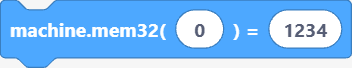{width=inherit} | `mem32Write` | `machine.mem32[address] = value` |
| {width=inherit} | `getCPUFreq` | `machine.freq()` |
| 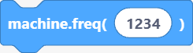{width=inherit} | `setCPUFreq` | `machine.freq(240000000)` |
| {width=inherit} | `ticksMs` | `time.ticks_ms()` |
| {width=inherit} | `ticksDiff` | `time.ticks_diff(t1, t2)` |
| 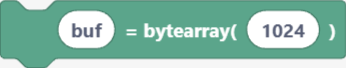{width=inherit} | `bytearrayInit` | `bytearray(10)` |

## Motion (sprite)

> {width=inherit}

| Image | Block `type` | Description |
| --- | --- | --- |
| {width=inherit} | `spriteMoveSteps` | Move the sprite forward a number of steps. |
| {width=inherit} | `spriteTurnRight` | Rotate the sprite clockwise. |
| {width=inherit} | `spriteTurnLeft` | Rotate the sprite anticlockwise. |
| {width=inherit} | `spriteGoToMenu` | Go to a target chosen from a menu. |
| {width=inherit} | `spriteGoToXY` | Go to an absolute X/Y position. |
| {width=inherit} | `spriteGlideToMenu` | Glide to a menu target over a number of seconds. |
| {width=inherit} | `spriteGlideToXY` | Glide to an X/Y position over a number of seconds. |
| {width=inherit} | `spritePointInDirection` | Point in a specific direction (degrees). |
| {width=inherit} | `spritePointTowards` | Point towards a target. |
| {width=inherit} | `spriteChangeX` | Change the sprite's X by an amount. |
| {width=inherit} | `spriteSetX` | Set the sprite's X position. |
| {width=inherit} | `spriteChangeY` | Change the sprite's Y by an amount. |
| {width=inherit} | `spriteSetY` | Set the sprite's Y position. |
| {width=inherit} | `spriteIfOnEdgeBounce` | Bounce when touching the stage edge. |
| {width=inherit} | `spriteSetRotationStyle` | Set the rotation style. |
| {width=inherit} | `spriteGetX` | Report the sprite's X position. |
| {width=inherit} | `spriteGetY` | Report the sprite's Y position. |
| {width=inherit} | `spriteGetDirection` | Report the sprite's direction. |

## Looks (sprite)

> {width=inherit}

| Image | Block `type` | Description |
| --- | --- | --- |
| {width=inherit} | `spriteShow` | Show the sprite. |
| {width=inherit} | `spriteHide` | Hide the sprite. |
| {width=inherit} | `spriteSwitchCostume` | Switch to another costume. |
| {width=inherit} | `spriteSetSize` | Set the sprite size (percent). |
| {width=inherit} | `spriteGetSize` | Report the sprite size. |

## Events (sprite)

> {width=inherit}

| Image | Block `type` | Description |
| --- | --- | --- |
| 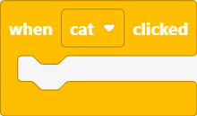{width=inherit} | `spriteWhenClicked` | Run blocks when the sprite is clicked. |

## Waveshare 3.5

> 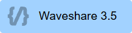{width=inherit}

| Image | Block `type` | Description |
| --- | --- | --- |
| 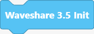{width=inherit} | `waveshare35Init` | Initialise the Waveshare 3.5" all-in-one display board. |

## Language

> {width=inherit}

| Image | Block `type` | Description |
| --- | --- | --- |
| 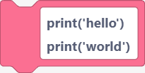{width=inherit} | `freeCode` | Insert a raw line of MicroPython. |
| {width=inherit} | `importCode` | `import <library>`. |
| {width=inherit} | `importCode2` | `import <library> as <alias>`. |
| {width=inherit} | `fromImportCode` | `from <library> import <component>`. |
| {width=inherit} | `forLoop` | `for` loop over a range. |
| {width=inherit} | `whileLoop` | `while` loop. |
| 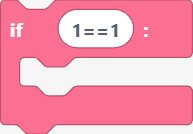{width=inherit} | `ifLoop` | `if` statement. |
| 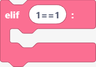{width=inherit} | `elseIfLoop` | `elif` branch. |
| 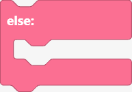{width=inherit} | `elseLoop` | `else` branch. |
| {width=inherit} | `print` | Print a value to the REPL. |
| {width=inherit} | `variable` | Assign a value to a variable. |
| {width=inherit} | `comment` | A `#` comment line. |
| {width=inherit} | `pass` | The `pass` statement. |
| 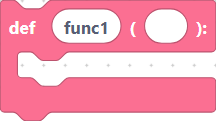{width=inherit} | `def` | Define a function. |
| 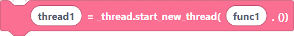{width=inherit} | `startThread` | Start a new thread with `_thread`. |

## List

> 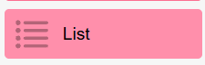{width=inherit}

| Image | Block `type` | Description |
| --- | --- | --- |
| 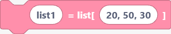{width=inherit} | `createList` | Create a list literal. |
| 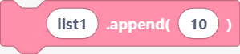{width=inherit} | `appendList` | Append a value. |
| 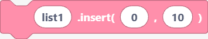{width=inherit} | `insertList` | Insert a value at an index. |
| {width=inherit} | `removeList` | Remove a value. |
| {width=inherit} | `popList` | Pop an item at an index. |
| {width=inherit} | `sortList` | Sort the list in place. |
| {width=inherit} | `reverseList` | Reverse the list in place. |
| {width=inherit} | `lenList` | Length of the list. |
| 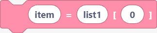{width=inherit} | `getList` | Get the item at an index. |
| {width=inherit} | `getListSlice` | Slice `[start:end]`. |
| {width=inherit} | `getListSlice2` | Slice `[start:]`. |
| {width=inherit} | `getListSlice3` | Slice `[:end]`. |
| {width=inherit} | `getListSlice4` | Copy slice `[:]`. |

## Dictionary

> {width=inherit}

| Image | Block `type` | Description |
| --- | --- | --- |
| 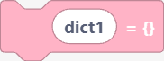{width=inherit} | `createDict` | Create an empty dict. |
| {width=inherit} | `dictSet` | Set `dict[key] = value`. |
| {width=inherit} | `dictGet` | Get `dict[key]`. |
| {width=inherit} | `dictKeys` | Get `dict.keys()`. |
| 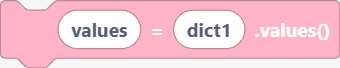{width=inherit} | `dictValues` | Get `dict.values()`. |
| {width=inherit} | `dictItems` | Get `dict.items()`. |
| {width=inherit} | `dictPop` | Pop a key. |
| 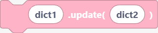{width=inherit} | `dictUpdate` | Update from another dict. |
| {width=inherit} | `dictClear` | Clear the dict. |

## Math

> {width=inherit}

| Image | Block `type` | Description |
| --- | --- | --- |
| 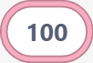{width=inherit} | `integerInit` | An integer literal. |
| {width=inherit} | `mathAdd` | Addition. |
| 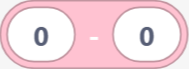{width=inherit} | `mathSubtract` | Subtraction. |
| {width=inherit} | `mathMultiply` | Multiplication. |
| 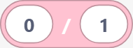{width=inherit} | `mathDivide` | Division. |
| 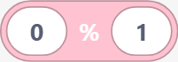{width=inherit} | `mathModulo` | Modulo. |
| 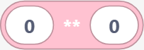{width=inherit} | `mathPower` | Exponentiation. |
| 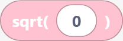{width=inherit} | `mathSqrt` | Square root. |
| {width=inherit} | `mathSin` | Sine. |
| {width=inherit} | `mathCos` | Cosine. |
| {width=inherit} | `mathTan` | Tangent. |
| {width=inherit} | `mathLog` | Logarithm. |
| {width=inherit} | `mathExp` | Exponential. |
| 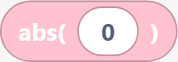{width=inherit} | `mathAbs` | Absolute value. |
| 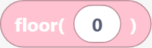{width=inherit} | `mathFloor` | Floor. |
| 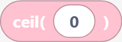{width=inherit} | `mathCeil` | Ceiling. |
| {width=inherit} | `mathRound` | Round. |
| {width=inherit} | `mathMin` | Minimum. |
| {width=inherit} | `mathMax` | Maximum. |
| 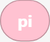{width=inherit} | `mathPi` | The constant π. |
| 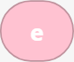{width=inherit} | `mathE` | The constant e. |
| {width=inherit} | `mathRandom` | Random float. |
| {width=inherit} | `mathRandomInt` | Random integer. |
| {width=inherit} | `divmod` | `divmod()` quotient and remainder. |
| {width=inherit} | `hex` | Hexadecimal string. |
| {width=inherit} | `ord` | Unicode code point. |

## String

> {width=inherit}

| Image | Block `type` | Description |
| --- | --- | --- |
| 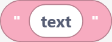{width=inherit} | `stringInit` | A string literal. |
| 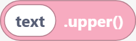{width=inherit} | `stringUpper` | Upper-case. |
| 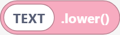{width=inherit} | `stringLower` | Lower-case. |
| {width=inherit} | `stringStrip` | Strip whitespace. |
| 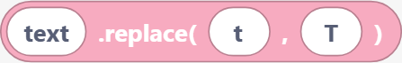{width=inherit} | `stringReplace` | Replace substring. |
| {width=inherit} | `stringFind` | Find substring index. |
| {width=inherit} | `stringSplit` | Split on a delimiter. |
| 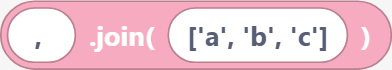{width=inherit} | `stringJoin` | Join a list with a delimiter. |
| {width=inherit} | `stringStartsWith` | Prefix test. |
| {width=inherit} | `stringEndsWith` | Suffix test. |
| 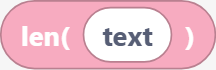{width=inherit} | `stringLength` | String length. |

## Random

> 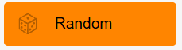{width=inherit}

| Image | Block `type` | Description |
| --- | --- | --- |
| {width=inherit} | `random` | Random float in `[0, 1)`. |
| {width=inherit} | `randint` | Random integer in a range. |
| {width=inherit} | `choice` | Random element from a sequence. |
| {width=inherit} | `shuffle` | Shuffle a sequence in place. |
| {width=inherit} | `uniform` | Random float in a range. |
| {width=inherit} | `randrange` | Random value from a range with a step. |
| {width=inherit} | `sample` | Random sample of unique elements. |

## Exception

> {width=inherit}

| Image | Block `type` | Description |
| --- | --- | --- |
| 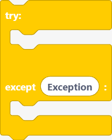{width=inherit} | `tryExcept` | `try` / `except` block. |
| {width=inherit} | `raiseException` | `raise` an exception. |
| {width=inherit} | `assertStatement` | `assert` a condition. |
| {width=inherit} | `finallyBlock` | `finally` clause. |

## Regex

> {width=inherit}

| Image | Block `type` | Description |
| --- | --- | --- |
| {width=inherit} | `reMatch` | `re.match`. |
| {width=inherit} | `reSearch` | `re.search`. |
| {width=inherit} | `reFindAll` | `re.findall`. |
| {width=inherit} | `reFindIter` | `re.finditer`. |
| {width=inherit} | `reSub` | `re.sub`. |
| {width=inherit} | `reSplit` | `re.split`. |
| {width=inherit} | `reCompile` | `re.compile`. |

## Requests

> 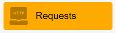{width=inherit}

| Image | Block `type` | Description |
| --- | --- | --- |
| {width=inherit} | `urequestsGet` | HTTP `GET`. |
| {width=inherit} | `urequestsPost` | HTTP `POST` with data. |
| {width=inherit} | `urequestsPut` | HTTP `PUT` with data. |
| {width=inherit} | `urequestsDelete` | HTTP `DELETE`. |
| {width=inherit} | `urequestsHead` | HTTP `HEAD`. |

## SemiBlock IoT

> 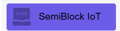{width=inherit}

| Image | Block `type` | Description |
| --- | --- | --- |
| {width=inherit} | `iotConnect` | Set the IoT server, device ID, and secret. |
| {width=inherit} | `iotPushReading` | Push a single sensor reading to the cloud. |
| {width=inherit} | `iotPushValue` | Push a keyed value to the cloud. |

## CSV

> {width=inherit}

| Image | Block `type` | Description |
| --- | --- | --- |
| {width=inherit} | `csvRead` | Read all rows of a CSV file into a list. |
| {width=inherit} | `csvWrite` | Write rows to a CSV file. |
| 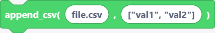{width=inherit} | `csvAppend` | Append a row to a CSV file. |

## OS

> {width=inherit}

| Image | Block `type` | Description |
| --- | --- | --- |
| {width=inherit} | `osListDir` | List directory contents. |
| {width=inherit} | `osRemove` | Remove a file. |
| {width=inherit} | `osRename` | Rename a file. |
| {width=inherit} | `osMkdir` | Make a directory. |
| {width=inherit} | `osRmdir` | Remove a directory. |
| {width=inherit} | `osGetcwd` | Current working directory. |
| {width=inherit} | `osChdir` | Change directory. |
| {width=inherit} | `osStat` | File status. |
| {width=inherit} | `osUname` | System information. |
| {width=inherit} | `osSync` | Flush filesystem buffers. |
| {width=inherit} | `osSystem` | Run a system command. |
| {width=inherit} | `osUrandom` | Random bytes. |

## Display (SSD1306)

> {width=inherit}

| Image | Block `type` | Description |
| --- | --- | --- |
| {width=inherit} | `ssd1306` | Create an SSD1306 I²C display object. |
| {width=inherit} | `ssd1306_fill` | Fill the screen buffer. |
| {width=inherit} | `ssd1306_show` | Flush the buffer to the screen. |
| {width=inherit} | `ssd1306_contrast` | Set contrast. |
| {width=inherit} | `ssd1306_invert` | Invert colours. |
| {width=inherit} | `ssd1306_rotate` | Rotate the display. |
| {width=inherit} | `ssd1306_text` | Draw text. |
| {width=inherit} | `ssd1306_pixel` | Set a pixel. |
| {width=inherit} | `ssd1306_hline` | Horizontal line. |
| {width=inherit} | `ssd1306_vline` | Vertical line. |
| {width=inherit} | `ssd1306_line` | Arbitrary line. |
| {width=inherit} | `ssd1306_rect` | Rectangle outline. |
| {width=inherit} | `ssd1306_fillRect` | Filled rectangle. |
| {width=inherit} | `ssd1306_circle` | Circle outline. |
| {width=inherit} | `ssd1306_fillCircle` | Filled circle. |
| {width=inherit} | `ssd1306_scroll` | Scroll the buffer. |
| {width=inherit} | `imageEditor` | Draw a bitmap in the SemiBlock image editor. |
| {width=inherit} | `drawPixels` | Render an edited bitmap to the display. |
| {width=inherit} | `ssd1306_setColor` | Set the draw colour. |
| {width=inherit} | `ssd1306_setFontSize` | Set the font size. |

## LVGL

| Block `type` | Description |
| --- | --- |
| `lvglInit` | `import lvgl as lv`. |
| `importLcdBus` | Import the LCD bus module. |
| `importSt7796` | Import the ST7796 driver. |
| `importSt7735` | Import the ST7735 driver. |
| `importTaskHandler` | Import the task handler. |
| `importFsDriver` | Import the filesystem driver. |
| `lcdSpiBusInit` | Initialise the LCD SPI bus. |
| `allocateFramebuffer` | Allocate a framebuffer. |
| `st7796Init` | Initialise an ST7796 panel. |
| `st7735Init` | Initialise an ST7735 panel. |
| `displayInit` | Generic display init. |
| `displayInitWithType` | Display init with a panel type. |
| `displaySetRotation` | Set screen rotation. |
| `displaySetColorInversion` | Toggle colour inversion. |
| `displaySetBacklight` | Set backlight level. |
| `taskHandlerInit` | Initialise the LVGL task handler. |
| `lvglFsDrvtInit` | Initialise the LVGL FS driver. |
| `lvglFsRegister` | Register the FS driver. |
| `lvglSetScrollbarMode` | Set scrollbar mode. |
| `lvglScreenCreate` | Create a screen object. |
| `lvglScreenLoad` | Load a screen. |
| `lvglScreenActive` | Get the active screen. |
| `lvglRefrNow` | Force an immediate refresh. |
| `lvglTaskHandler` | Run one task-handler pass. |
| `lvglLabelCreate` | Create a label. |
| `lvglLabelSetText` | Set label text. |
| `lvglButtonCreate` | Create a button. |
| `lvglContainerCreate` | Create a container. |
| `lvglSetPos` | Set object position. |
| `lvglSetSize` | Set object size. |
| `lvglSetWidth` | Set object width. |
| `lvglSetHeight` | Set object height. |
| `lvglSetX` | Set object X. |
| `lvglSetY` | Set object Y. |
| `lvglAlign` | Align an object. |
| `lvglSliderCreate` | Create a slider. |
| `lvglSliderSetValue` | Set slider value. |
| `lvglSliderGetValue` | Get slider value. |
| `lvglBarCreate` | Create a bar. |
| `lvglBarSetValue` | Set bar value. |
| `lvglArcCreate` | Create an arc. |
| `lvglArcSetValue` | Set arc value. |
| `lvglCheckboxCreate` | Create a checkbox. |
| `lvglCheckboxSetText` | Set checkbox text. |
| `lvglSwitchCreate` | Create a switch. |
| `lvglTextareaCreate` | Create a text area. |
| `lvglTextareaSetText` | Set text-area text. |
| `lvglDropdownCreate` | Create a dropdown. |
| `lvglDropdownSetOptions` | Set dropdown options. |
| `lvglRollerCreate` | Create a roller. |
| `lvglRollerSetOptions` | Set roller options. |
| `lvglImageCreate` | Create an image. |
| `lvglImageSetSrc` | Set image source. |
| `lvglImageSetSrcCostume` | Set image source from a costume. |
| `lvglLedCreate` | Create an LED widget. |
| `lvglLedOn` | Turn the LED widget on. |
| `lvglLedOff` | Turn the LED widget off. |
| `lvglLedToggle` | Toggle the LED widget. |
| `lvglLedSetBrightness` | Set LED-widget brightness. |
| `lvglKeyboardCreate` | Create a keyboard. |
| `lvglKeyboardSetTextarea` | Bind keyboard to a text area. |
| `lvglTabviewCreate` | Create a tab view. |
| `lvglTabviewAddTab` | Add a tab. |
| `lvglSetBgColor` | Set background colour. |
| `lvglSetTextColor` | Set text colour. |
| `lvglSetOpacity` | Set opacity. |
| `lvglSetStyleTextFont` | Set the text font style. |
| `lvglSetStyleBgOpa` | Set the background-opacity style. |
| `lvglSetStyleRadius` | Set the corner-radius style. |
| `lvglSetStylePad` | Set the padding style. |
| `lvglSetStyleBorderWidth` | Set the border-width style. |
| `lvglSetStyleBorderColor` | Set the border-colour style. |
| `lvglSetStyleShadowWidth` | Set the shadow-width style. |
| `lvglSetStyleShadowColor` | Set the shadow-colour style. |
| `lvglColorHex` | Make a colour from a hex value. |
| `lvglGetDisplay` | Get the display handle. |
| `lvglAddEventCb` | Add an event callback. |
| `lvglSpinnerCreate` | Create a spinner. |
| `lvglChartCreate` | Create a chart. |
| `lvglChartAddSeries` | Add a chart series. |
| `lvglChartSetPoint` | Set a chart point. |
| `lvglMeterCreate` | Create a meter. |
| `lvglAddFlag` | Add an object flag. |
| `lvglClearFlag` | Clear an object flag. |
| `lvglRemoveFlag` | Remove an object flag. |
| `lvglAnimCreate` | Create an animation. |
| `lvglAnimInit` | Initialise an animation. |
| `lvglAnimSetVar` | Set the animation target. |
| `lvglAnimSetTime` | Set the animation duration. |
| `lvglAnimSetValues` | Set the animation start/end. |
| `lvglAnimStart` | Start an animation. |
| `lvglObjDelete` | Delete an object. |
| `lvglObjClean` | Remove an object's children. |
| `lvglObjInvalidate` | Mark an object for redraw. |
| `lvglCanvasCreate` | Create a canvas. |
| `lvglCanvasSetBuffer` | Set the canvas buffer. |
| `lvglCanvasFillBg` | Fill the canvas background. |
| `lvglCanvasSetPx` | Set a canvas pixel. |
| `lvglTickInc` | Advance the LVGL tick counter. |

## Pin

| Block `type` | Description |
| --- | --- |
| `pin` | Create a `Pin` with a direction. |
| `pin2` | Create a `Pin` with input + pull type. |
| `on` | Drive the pin high. |
| `off` | Drive the pin low. |
| `pinValue` | Read the pin value. |
| `uartInit` | Initialise a UART. |
| `uartRead` | Read bytes from UART. |
| `uartWrite` | Write to UART. |
| `neoPixel` | Create a NeoPixel strip. |
| `neoPixelWrite` | Set and write a NeoPixel colour. |

## Timer

| Block `type` | Description |
| --- | --- |
| `timerInit` | Create a `Timer`. |
| `timerStart` | Start a periodic/one-shot timer. |
| `timerStop` | De-initialise the timer. |

## PWM

| Block `type` | Description |
| --- | --- |
| `pwmInit` | Create a PWM on a pin. |
| `pwmSetFreq` | Set PWM frequency. |
| `pwmSetDuty` | Set PWM duty cycle. |
| `pwmDeinit` | De-initialise PWM. |

## ADC

| Block `type` | Description |
| --- | --- |
| `adcInit` | Create an ADC on a pin. |
| `adcRead` | Read the ADC. |
| `dacInit` | Create a DAC on a pin. |
| `dacWrite` | Write to the DAC. |

## SPI

| Block `type` | Description |
| --- | --- |
| `spiInit` | Create a hardware SPI. |
| `spiBusInit` | Initialise an SPI bus. |
| `spiRead` | Read from SPI. |
| `spiWrite` | Write to SPI. |
| `spiReadWrite` | Full-duplex read into a buffer. |

## I2C

| Block `type` | Description |
| --- | --- |
| `i2cInit` | Create an I²C bus. |
| `i2cScan` | Scan for I²C addresses. |
| `i2cRead` | Read from a device. |
| `i2cWrite` | Write to a device. |

## WatchDog (RTC, WDT, deep sleep)

| Block `type` | Description |
| --- | --- |
| `rtcInit` | Create an `RTC`. |
| `rtcSetTime` | Set the RTC datetime. |
| `rtcGetTime` | Get the RTC datetime tuple. |
| `rtcGetYear` | Get the year. |
| `rtcGetMonth` | Get the month. |
| `rtcGetDay` | Get the day. |
| `rtcGetHour` | Get the hour. |
| `rtcGetMinute` | Get the minute. |
| `rtcGetSecond` | Get the second. |
| `wdtInit` | Create a watchdog timer. |
| `wdtFeed` | Feed the watchdog. |
| `deepSleep` | Enter deep sleep for a duration. |

## SD Card

| Block `type` | Description |
| --- | --- |
| `sdCardInit` | Create an `SDCard`. |
| `sdCardMount` | Mount the card. |
| `sdCardUnmount` | Unmount the card. |
| `sdCardFileWrite` | Write a file to the card. |
| `sdCardFileRead` | Read a file from the card. |

## RMT

| Block `type` | Description |
| --- | --- |
| `rmtInit` | Create an RMT channel. |
| `rmtWrite` | Write RMT pulses. |
| `rmtDeinit` | De-initialise RMT. |

## One-Wire

| Block `type` | Description |
| --- | --- |
| `oneWireInit` | Create a OneWire bus. |
| `oneWireScan` | Scan for OneWire devices. |
| `oneWireRead` | Read a byte. |
| `oneWireWrite` | Write a byte. |

## Capacitive Touch

| Block `type` | Description |
| --- | --- |
| `touchInit` | Create a `TouchPad`. |
| `touchRead` | Read the touch value. |

## DHT

| Block `type` | Description |
| --- | --- |
| `dhtInit` | Create a DHT sensor. |
| `dhtReadTemperature` | Measure and read temperature. |
| `dhtReadHumidity` | Measure and read humidity. |

## HC-SR04 Sonar

| Block `type` | Description |
| --- | --- |
| `hcsr04Init` | Define the driver and create an HC-SR04 sensor. |
| `hcsr04DistanceCm` | Read distance in centimetres. |
| `hcsr04DistanceMm` | Read distance in millimetres. |

## Sensors

| Block `type` | Description |
| --- | --- |
| `temperature` | Read an analog thermistor via `getTemperature`. |
| `fourDigitDisplay` | Create a TM1637 4-digit display. |
| `fourDigitDisplay_setNumber` | Show a number on the display. |
| `motor` | Create a DC-motor control pin. |
| `motorOn` | Turn the motor on. |
| `motorOff` | Turn the motor off. |
| `servo` | Create a servo. |
| `servoAngle` | Set the servo angle. |

## Generative AI

| Block `type` | Description |
| --- | --- |
| `askDeepSeek` | Ask a DeepSeek LLM a question and store the answer. |

## Open Data

| Block `type` | Description |
| --- | --- |
| `getOpenDataTemperature` | Get temperature for a location. |
| `getOpenDataRainfall` | Get rainfall for a location. |
| `getOpenDataHumidity` | Get humidity. |
| `getPublicHoliday` | Get public holiday data. |
| `getBusStopID` | Look up a bus stop ID. |
| `getBusRouteNo` | Look up a bus route number. |
| `getBusArrivalTime` | Get bus arrival time. |
| `getFlightList` | Get a flight list. |
| `getMTR` | Get MTR information. |

---

**Next:** [Category color legend](categories.md)
