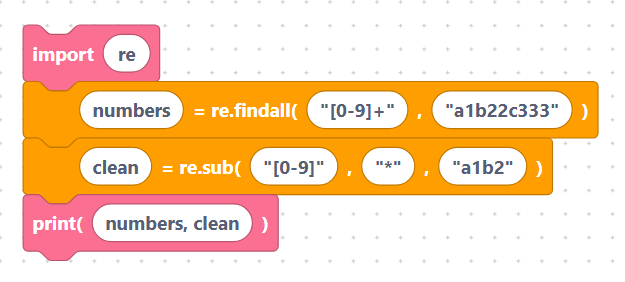

# `findall`, `finditer`, `sub`, `split`

These blocks pull out every match, replace matches, or split text by a pattern.
Each needs an [`import re`](../language/imports.md) block.

Fields are inserted **verbatim**, so quote literal text. Each block emits a
**bare call** — plug it into a [variable](../language/variables.md) block to keep
the result.

## The `reFindAll` block

- **Label:** `result = re.findall(%1, %2)` — inputs `pattern`, `string`. Returns a
  list of **all** matches.

```python
re.findall(pattern, string)
```

> {width=inherit}

## The `reFindIter` block

- **Label:** `result = re.finditer(%1, %2)` — inputs `pattern`, `string`. Returns
  an iterator of matches, good for a [`for` loop](../language/for-loop.md).

```python
re.finditer(pattern, string)
```

> {width=inherit}

## The `reSub` block

- **Label:** `result = re.sub(%1, %2, %3)` — inputs `pattern`, `replacement`,
  `string`. Replaces every match with new text.

```python
re.sub(pattern, replacement, string)
```

> {width=inherit}

## The `reSplit` block

- **Label:** `result = re.split(%1, %2)` — inputs `pattern`, `string`. Splits the
  text wherever the pattern matches.

```python
re.split(pattern, string)
```

> {width=inherit}

## Worked example

```python
import re

numbers = re.findall("[0-9]+", "a1b22c333")
clean = re.sub("[0-9]", "*", "a1b2")
print(numbers, clean)
```

> {width=inherit}

## Next

Continue to [Operating System (`os` module)](../os/index.md)
