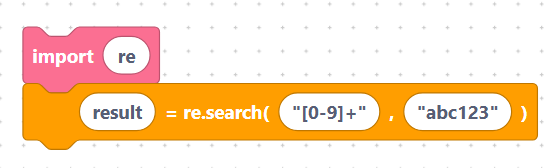

# Regular Expressions

A **regular expression** (regex) is a pattern for matching text — for example
"three digits followed by a letter". The Regex category wraps MicroPython's `re`
module so you can search, match, and replace inside strings.

Add an [`import re`](../language/imports.md) block to your program so these
blocks work.

> Note: these blocks show an assignment in their label (e.g.
> `result = re.match(...)`), but the current generator emits only the **bare
> call** — for example `re.match(pattern, string)`. To keep the result, plug the
> block into a [variable](../language/variables.md) block yourself.

## What you will learn

- [`re.match`, `re.search`, `re.compile`](match-search.md)
- [`findall`, `finditer`, `sub`, `split`](find-replace.md)

## A quick taste

```python
import re

re.search("[0-9]+", "abc123")
```

> {width=inherit}

## Next

Continue to [`re.match`, `re.search`, `re.compile`](match-search.md)
