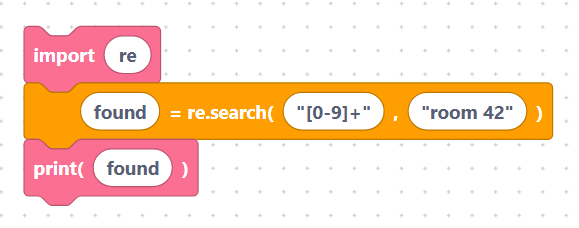

# `re.match`, `re.search`, `re.compile`

These blocks look for a pattern in some text. Each needs an
[`import re`](../language/imports.md) block.

The pattern and string fields are inserted **verbatim**, so quote literal text.
Each block emits a **bare call** — to keep the result, plug the block into a
[variable](../language/variables.md) block.

## The `reMatch` block

- **Label:** `result = re.match(%1, %2)` — inputs `pattern` (default `pattern`),
  `string` (default `string`). Checks for a match at the **start** of the text.

```python
re.match(pattern, string)
```

> {width=inherit}

## The `reSearch` block

- **Label:** `result = re.search(%1, %2)` — inputs `pattern`, `string`. Looks for
  a match **anywhere** in the text.

```python
re.search(pattern, string)
```

> {width=inherit}

## The `reCompile` block

- **Label:** `pattern = re.compile(%1)` — input `pattern`. Pre-builds a pattern
  you can reuse.

```python
re.compile(pattern)
```

> {width=inherit}

## Worked example

With quoted text and a variable to keep the result:

```python
import re

found = re.search("[0-9]+", "room 42")
print(found)
```

> {width=inherit}

`re.search` returns a match object if it finds something, or `None` if not —
perfect to test with an [`if`](../language/if-else.md) block.

## Next

Continue to [`findall`, `finditer`, `sub`, `split`](find-replace.md)
