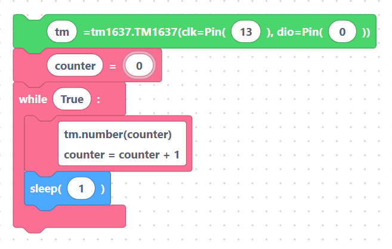

# [Wait Until Bug Fixed] 4-Digit 7-Segment Display

A **TM1637 4-digit 7-segment display** is a small red LED module that can show four digits — great
for clocks, counters, and sensor readouts. It uses just two signal wires (`CLK` and `DIO`) plus
power. SemiBlock drives it with the `TM1637` driver.

## How to wire it

| Module pin | Connect to | Notes |
|------------|-----------|-------|
| `VCC` | `3V3` (or `5V`) | the module is happy at either |
| `GND` | `GND` | shared ground |
| `CLK` | a GPIO (default **GPIO 13**) | clock line |
| `DIO` | a GPIO (default **GPIO 0**) | data line |

## The blocks

- **`fourDigitDisplay`** — create the display object on the `CLK` and `DIO` pins.
- **`fourDigitDisplay_setNumber`** — show a number on the four digits.

### Create the display

With the default fields (variable `tm`, clk `13`, dio `0`) the block generates:

```python
tm=TM1637(clk = Pin(13), dio = Pin(0))
```

> 

### Show a number

`fourDigitDisplay_setNumber` (variable `tm`, number `1234`) generates:

```python
tm.number(1234)
```

> 

The `number()` method displays an integer right-aligned across the four digits. Values from
`0` to `9999` fit; negative or larger values depend on your TM1637 driver build.

> **Tip:** make sure the variable name in the *set number* block matches the name you used when
> you created the display (`tm` by default), otherwise MicroPython will raise a `NameError`.

## Complete example — count up every second

```python
tm=TM1637(clk = Pin(13), dio = Pin(0))

counter = 0
while True:
    tm.number(counter)
    counter = counter + 1
    sleep(1)
```

> 

The program creates the display once, then every second shows the next number and increments the
counter — a simple seconds counter on the 4-digit display.

## Next

Switch a DC motor on and off with the [DC Motor block](motor.md).
