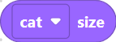
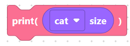
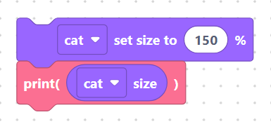
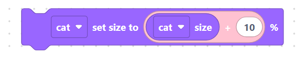

# Size

These two blocks control how big a sprite is drawn on the **simulator** stage.
Size is a percentage: `100` is normal, `50` is half, `200` is double.

## `spriteSetSize` — set size to N %

Sets the sprite's scale.

**Inputs**

- **sprite** — sprite picker (default `cat`).
- **SIZE** — a Number value input (default shadow `100`).

**Generated code** (sprite `cat`, `SIZE = 100`):

```python
sprite.set_size("cat", 100)
```

> 

## `spriteGetSize` — size

A **reporter** block that returns the sprite's current size as a percentage.
Drop it inside another block — a number input, a `print`, or an `if`. Takes
only the sprite picker.

**Generated code** (sprite `cat`):

```python
sprite.get_size("cat")
```

> 

Used inside a `print`, for example:

```python
print(sprite.get_size("cat"))
```

> 

## Worked example: grow then check

Make the cat 50% bigger, then report its new size:

```python
sprite.set_size("cat", 150)
print(sprite.get_size("cat"))
```

> 

The stage redraws the cat at 1.5× its normal size, and the simulator console
shows `150`.

You can also feed the reporter back into a *set size* block to scale relative to
the current value — handy for a pulsing effect inside a loop:

```python
sprite.set_size("cat", sprite.get_size("cat") + 10)
```

> 

## Next

Continue to **[Events blocks »](../events/index.md)**
