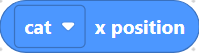
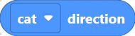
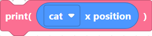
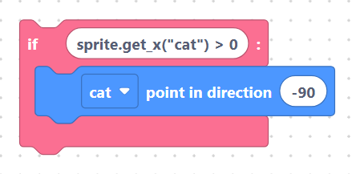
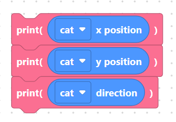

# Position Getters

These three **reporter** blocks reveal the sprite's current state on the
**simulator** stage. Reporters are rounded blocks that produce a value, so you
drop them *inside* other blocks — a number input, a `print`, an `if`
condition, or a variable assignment.

Each reporter has only a sprite picker dropdown (default `cat`).

## `spriteGetX` — x position

Reports the sprite's current x-coordinate.

**Generated code** (sprite `cat`):

```python
sprite.get_x("cat")
```

> {width=inherit}

## `spriteGetY` — y position

Reports the sprite's current y-coordinate.

**Generated code** (sprite `cat`):

```python
sprite.get_y("cat")
```

> {width=inherit}

## `spriteGetDirection` — direction

Reports the sprite's facing direction in degrees (`90` = right, `0` = up).

**Generated code** (sprite `cat`):

```python
sprite.get_direction("cat")
```

> {width=inherit}

## Using a reporter

Because these blocks return a value, they slot into expressions. For example,
dropping `x position` into a `print` block produces:

```python
print(sprite.get_x("cat"))
```

> {width=inherit}

And used in a comparison to test whether the cat has crossed the centre line:

```python
if sprite.get_x("cat") > 0:
    sprite.point_in_direction("cat", -90)
```

> {width=inherit}

## Worked example: report all three

```python
print(sprite.get_x("cat"))
print(sprite.get_y("cat"))
print(sprite.get_direction("cat"))
```

> {width=inherit}

This prints the cat's position and heading to the simulator console — handy for
checking where a sprite ended up after a sequence of motion blocks.

## Next

Continue to **[Looks blocks »](../looks/index.md)**
