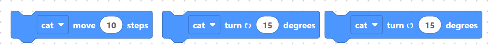
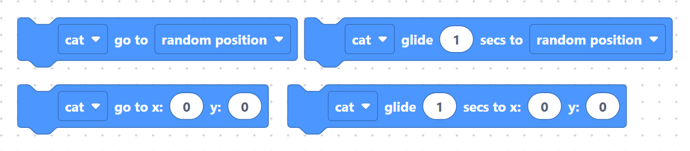
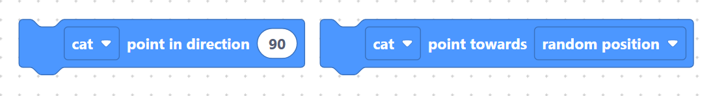
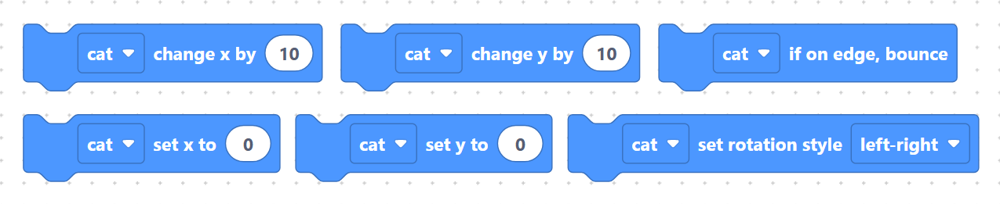
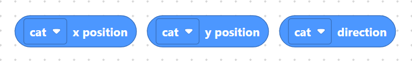

# Motion

> {width=inherit}

Motion blocks move your sprite around the **simulator stage**. They are the
blue Scratch-style blocks, and each one generates a call into the simulator's
Python `sprite` module — nothing here runs on the microcontroller.

Every motion block has a **sprite picker** dropdown (default `cat`) whose value
becomes the first argument of the generated call.

## What's in this category

- **[Move & turn](move-turn.md)** — step forward and rotate.
  - `spriteMoveSteps`, `spriteTurnRight`, `spriteTurnLeft`

> {width=inherit}

- **[Go to & glide](goto-glide.md)** — jump or smoothly slide to a spot.
  - `spriteGoToMenu`, `spriteGoToXY`, `spriteGlideToMenu`, `spriteGlideToXY`

> {width=inherit}

- **[Pointing](point.md)** — face a direction or a target.
  - `spritePointInDirection`, `spritePointTowards`

> {width=inherit}

- **[Position & rotation](position.md)** — nudge or set X/Y, bounce on edges,
  pick a rotation style.
  - `spriteChangeX`, `spriteSetX`, `spriteChangeY`, `spriteSetY`,
    `spriteIfOnEdgeBounce`, `spriteSetRotationStyle`

> {width=inherit}

- **[Position getters](getters.md)** — read the sprite's current state.
  - `spriteGetX`, `spriteGetY`, `spriteGetDirection`

> {width=inherit}

## Stage coordinates

The simulator stage uses Scratch-style coordinates: `x` increases to the right,
`y` increases upward, and `(0, 0)` is the centre. Direction is measured in
degrees where `90` points right and `0` points up.

## Next

Continue to **[Move & turn »](move-turn.md)**
