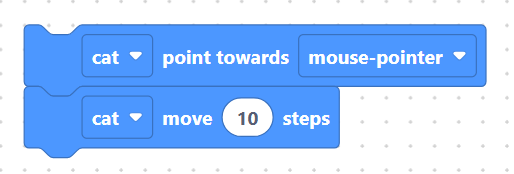

# Pointing

Pointing blocks change which way the sprite **faces** without moving it. After
pointing, a *move steps* block will travel in the new direction. These run in
the **simulator**.

Direction is measured in degrees: `90` points right, `0` points up, `180`
points down, and `-90` (or `270`) points left.

## `spritePointInDirection` — point in direction

Sets the sprite's heading to an exact angle.

**Inputs**

- **sprite** — sprite picker (default `cat`).
- **DEG** — a Number value input (default shadow `90`).

**Generated code** (sprite `cat`, `DEG = 90`):

```python
sprite.point_in_direction("cat", 90)
```

> 


## `spritePointTowards` — point towards a target

Rotates the sprite so it faces a target. The target dropdown offers the same
options as the *go to* menu:

| You pick | Generated argument |
| -------- | ------------------ |
| random position | `"_random_"` |

> 

| You pick | Generated argument |
| -------- | ------------------ |
| mouse-pointer | `"_mouse_"` |

> 

| You pick | Generated argument |
| -------- | ------------------ |
| *another sprite name* | `"that_sprite"` |

> 

**Inputs**

- **sprite** — sprite picker (default `cat`).
- **TOWARDS** — the target dropdown.

**Generated code** (sprite `cat`, target *mouse-pointer*):

```python
sprite.point_towards("cat", "_mouse_")
```

> 

## Worked example: chase the mouse

Combine pointing with moving so the cat follows your cursor:

```python
sprite.point_towards("cat", "_mouse_")
sprite.move_steps("cat", 10)
```

> 

Each time these run, the cat turns to face the mouse-pointer and steps 10
towards it. Put them in a loop for a continuous chase.

## Next

Continue to **[Position & rotation »](position.md)**
