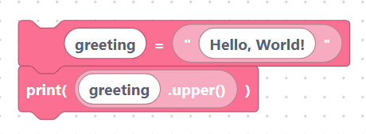

# String

> {width=inherit}

A **string** is a piece of text such as `"hello"` or `"sensor 3"`. The String
category has blocks for creating text and for transforming and inspecting it.

Most string blocks are **value blocks** that return a result you plug into a
variable or a `print`.

> Important: the text fields are inserted into the generated code **verbatim**.
> To create a text literal, type the quotes yourself — e.g. `"hello"`. A field
> without quotes is treated as a variable name.

## What you will learn

- [Creating strings](create.md)
- [`upper`, `lower`, `strip`, `replace`](case.md)
- [`find`, `split`, `join`](search.md)
- [`startswith`, `endswith`, `length`](predicate.md)

## A quick taste

```python
greeting = "Hello, World!"
print(greeting.upper())
```

> 

## Next

Continue to [Creating strings](create.md)
