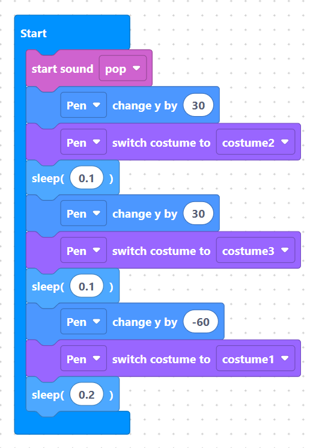
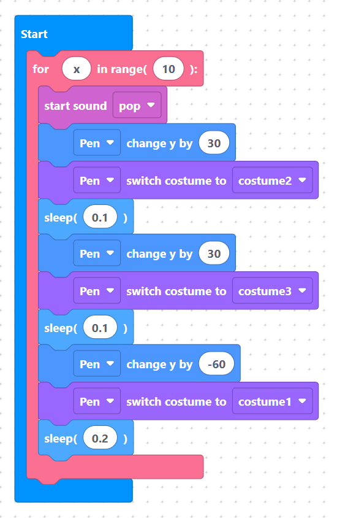

# Tutorial 1-1: The Dancing Penguin

{width=inherit}

## Overview
In this project, you will create an animated, dancing penguin! You will draw custom costumes, program code loops, control sprite movements, and play background music.

You will learn how to:
1. Choose and rename a sprite.
2. Draw two costumes for jumping animation.
3. Switch costumes inside a loop.
4. Move a sprite up and down using coordinates.
5. Play sound and music in the background.


## What You Are Building
* **Penguin Sprite:** Switches costumes and moves up and down to look like it is jumping and dancing.
* **Music:** Plays a fun sound effect in the background while the penguin jumps.


## Part 1 - Setup

Before we begin coding our dancing penguin, let's set up our workspace by adding our main character and choosing a clean backdrop.


### Step 1 - Open the Designer Panel
Click **"Designer"** on the right panel to open the sprite and background controls.

> {width=inherit}


### Step 2 - Add a New Object
Click **"Add object"** as shown in the interface to open the object library.

> {width=inherit}

### Step 3 - Choose and Name Your Character
1. Search or scroll to find the **Penguin**.
2. Click to select it.
3. Change its name to **`Pen`**.

> {width=inherit}

### Step 4 - Select Stage Background"
The default background is a bit messy, so let's change it! Click the stage photo icon as shown in the interface.

> {width=inherit}

### Step 5 - Pick a Better Backdrop
Browse the backdrop gallery and select a clean, suitable background for **Pen** to dance on!

> {width=inherit}


## Part 2 - Core Building Blocks

Now that Pen is on stage, let's learn the four basic skills needed to bring our penguin to life: drawing a costume, switching looks, moving around, and playing audio.

### Step 1 - Draw New Costumes
1. Click **Character**"** in the top-left corner of the panel.

> {width=inherit}

1. Click the **paint brush** button in the bottom-left corner to create a new costume.

> {width=inherit}

3. Use the tools to draw 2 more costumes. See the examples below:

> {width=inherit}


## Part 3 - Switch Costumes
There are 2 ways to change costumes in microPython:
1. `switch costume to "costume1"` – Changes to a specific costume by name.

> {width=inherit}

2. `next costume` – Switches to the very next costume in your list.

> {width=inherit}

Try both blocks by placing them inside a `Start` block. After assembling your code, click **Run** in the right panel to test it!

> {width=inherit} {width=inherit}


## Part 4 - Move An Object
In SemiBlock (MicroPython), we use an **X and Y coordinate grid** to control where objects are on stage:
* **X-axis** controls **horizontal** movement (Left and Right).
* **Y-axis** controls **vertical** movement (Up and Down).

There are 3 main ways to move an object:
1. `spriteChangeX` / `spriteChangeY` – Moves the object **relative** to its current position (e.g., `change y by 20` pushes Pen 20 steps UP from where he is standing).

> {width=inherit} {width=inherit}

2. `spriteSetX` / `spriteSetY` – Teleports the object directly to an **exact position** on the stage (e.g., `spriteSetY` snaps Pen straight to the middle line).

> {width=inherit} {width=inherit}


### Try It Out!

> {width=inherit}

Let's experiment with these four movement blocks:
1. Drag out `change y by (50)` and snap it under a `Start` block. Click **Run** on the right panel to see Pen move up.
2. Now try `change y by (-50)` to bring Pen back down.
3. Test `set y to (0)` to see Pen snap straight to the center line!
4. Try changing the numbers in `change x by (...)` and `set x to (...)` to see how Pen moves left and right.


## Part 5 - Play Sound
By default, every project comes with a sound called **"pop"**. If you want to use your own sound effects or background music, you can click on **"Customise Sound"** in the panel to browse or upload new audio files.

There are 2 main ways to play a sound in SemiBlock:
1. `start sound "pop"` – Plays the sound immediately in the background while your code continues running to the next block.

> {width=inherit}

2. `play sound "pop" until done` – Plays the entire sound and pauses your code until the audio finishes.

> {width=inherit}


### Try It Out!

> {width=inherit}

1. Drag `start sound "pop"` and snap it under a `Start` block.
2. Click **Run** on the right panel to hear Pen make a sound!
3. Try swapping it with `play sound "pop" until done` to see the difference.


## Part 6 - Combine It All!

Now it's time to put together costumes, Y-axis movement, sounds, and delays to create a full jump animation for Pen!

### Example 1 - The Basic Jump Routine (Single Jump)

This part show you how one single jump is built step-by-step:

```python

sound.start("pop")
sprite.change_y("Pen", 30)
sprite.switch_costume("Pen", "costume2")
sleep(0.1)
sprite.change_y("Pen", 30)
sprite.switch_costume("Pen", "costume3")
sleep(0.1)
sprite.change_y("Pen", -60)
sprite.switch_costume("Pen", "costume1")
sleep(0.2)

```

> {width=inherit}

- `sound.start("pop")`**: Plays a pop sound effect right as the jump begins.

- `sprite.change_y("Pen", 30)` & `sprite.switch_costume("Pen", "costume2")`**: Pen moves up 30 pixels and switches to his mid-air pose.

- `sleep(0.1)`**: Pauses for 0.1 seconds so your eyes can see the first phase of the jump.

- `sprite.change_y("Pen", 30)` & `sprite.switch_costume("Pen", "costume3")`**: Pen reaches his highest point (+60 total height) and changes to his full jump costume.

- `sleep(0.1)`**: Holds the highest pose briefly.

- `sprite.change_y("Pen", -60)` & `sprite.switch_costume("Pen", "costume1")`**: Pen drops back down to his starting floor level and switches back to his default standing costume.

- `sleep(0.2)`**: Gives Pen a short landing pause before completing the sequence.


### Example 2 - Loop Option A: Repeat 10 Times (`for` loop)

If you want Pen to jump **10** times in a row without writing the same code over and over, wrap your jump routine inside a `for` loop:

> {width=inherit}

```python

for x in range(10):
    sound.start("pop")
    sprite.change_y("Pen", 30)
    sprite.switch_costume("Pen", "costume2")
    sleep(0.1)
    sprite.change_y("Pen", 30)
    sprite.switch_costume("Pen", "costume3")
    sleep(0.1)
    sprite.change_y("Pen", -60)
    sprite.switch_costume("Pen", "costume1")
    sleep(0.2)

```

> {width=inherit}

- `for x in range(10):`: Tells the computer to repeat all the indented blocks underneath it 10 times.

### Example 3 - Loop Option B: Dance Forever! (`while` loop)

If you want Pen to keep jumping continuously until you press the stop button, wrap your jump routine inside a `while True` loop:

> {width=inherit}

```python

while True:
    sound.start("pop")
    sprite.change_y("Pen", 30)
    sprite.switch_costume("Pen", "costume2")
    sleep(0.1)
    sprite.change_y("Pen", 30)
    sprite.switch_costume("Pen", "costume3")
    sleep(0.1)
    sprite.change_y("Pen", -60)
    sprite.switch_costume("Pen", "costume1")
    sleep(0.2)

```

- `while True:`: Creates an infinite loop that runs the indented code repeatedly without stopping.


## Challenge: Customize Pen's Dance!

Now that you've mastered the basic jump loops, try changing the values in your code to make the animation your own!

### Try these challenges:
1. **Super Jump:** Change the movement values so Pen jumps twice as high! *(Hint: Increase `sprite.change_y("Pen", 30)` to a larger positive number, and make sure to adjust the landing distance so he returns to the ground.)*
2. **Slow-Motion Dance:** Double the numbers inside all the `sleep()` functions to see what happens to Pen's speed.
3. **Speed Dancing:** Make Pen jump super fast by lowering the `sleep()` delays to `0.05`.
4. **Custom Loop Count:** Change `range(10)` in the `for` loop so Pen jumps 5 times or 20 times!

---

### Common Mistakes to Avoid

Here are a few common issues students run into when coding animations in MicroPython:

1. **Forgetting `sleep()` in Loops**
   * **Problem:** Pen teleports instantly or the screen freezes/crashes.
   * **Fix:** Computers execute code in milliseconds. You must include `sleep()` blocks between costume changes and movements so human eyes can actually see the animation steps.

2. **Unbalanced Up and Down Movement**
   * **Problem:** Pen flies off the top of the stage or sinks into the ground after every jump.
   * **Fix:** Make sure the total downward distance matches the total upward distance! If Pen goes up $+30$ and $+30$ (total $+60$), he must go down $-60$ to return to his original position.

3. **Misspelled Sprite or Costume Names**
   * **Problem:** The sprite doesn't move or change looks.
   * **Fix:** Python is case-sensitive! Make sure `"Pen"`, `"costume1"`, `"costume2"`, and `"costume3"` exactly match the names defined in your project setup.


## Next

Next tutorial [Testing](tut2.md).