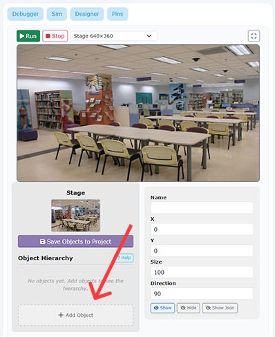

# Tutorial 1: The Dancing Penguin

## Overview
In this project, you will create an animated, dancing penguin! You will draw custom costumes, program code loops, control sprite movements, and play background music.

You will learn how to:
1. Choose and rename a sprite.
2. Draw two costumes for jumping animation.
3. Switch costumes inside a loop.
4. Move a sprite up and down using coordinates.
5. Play sound and music in the background.

## What You Are Building
* **Penguin Sprite:** Switches costumes and moves up and down to look like it is jumping and dancing.
* **Music:** Plays a fun sound effect in the background while the penguin jumps.

## Part 1 - Setup

> Before we begin coding our dancing penguin, let's set up our workspace by adding our main character and choosing a clean backdrop.

### Step 1 - Open the Designer Panel
Click **"Designer"** on the right panel to open the sprite and background controls.

> {width=inherit}

### Step 2 - Add a New Object
Click **"Add object"** as shown in the interface to open the object library.

> {width=inherit}

### Step 3 - Choose and Name Your Character
1. Search or scroll to find the **Penguin**.
2. Click to select it.
3. Change its name to **`Pen`**.

> {width=inherit}

### Step 4 - Select Stage Background"
The default background is a bit messy, so let's change it! Click the stage photo icon as shown in the interface.

> {width=inherit}

### Step 5 - Pick a Better Backdrop
Browse the backdrop gallery and select a clean, suitable background for **Pen** to dance on!

> {width=inherit}

---

## What You Did
* Added a new sprite (**Pen**) to the workspace.
* Customized the stage background for a cleaner presentation.
