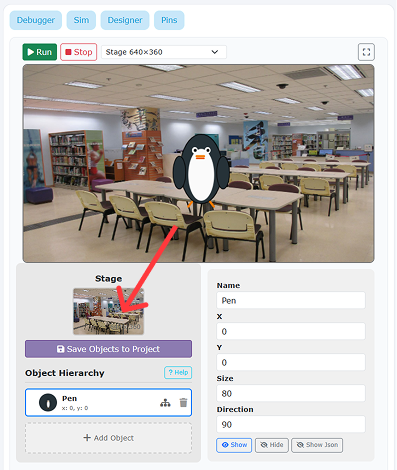
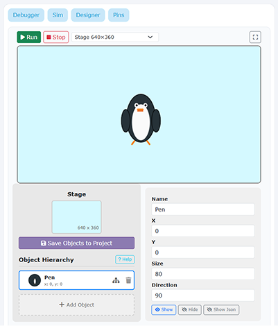
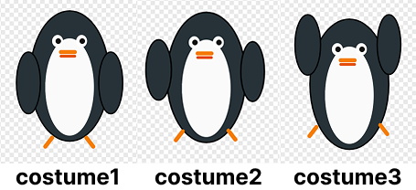
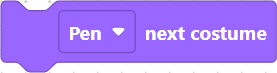
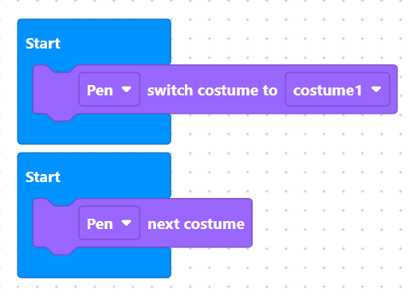
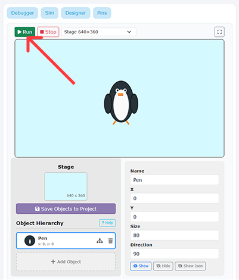
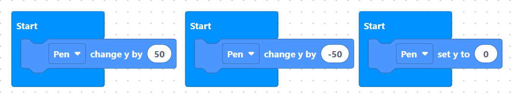
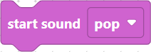
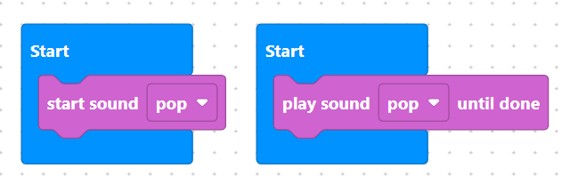

# Tutorial 1-1: The Dancing Penguin

## Overview
In this project, you will create an animated, dancing penguin! You will draw custom costumes, program code loops, control sprite movements, and play background music.

You will learn how to:
1. Choose and rename a sprite.
2. Draw two costumes for jumping animation.
3. Switch costumes inside a loop.
4. Move a sprite up and down using coordinates.
5. Play sound and music in the background.

## What You Are Building
* **Penguin Sprite:** Switches costumes and moves up and down to look like it is jumping and dancing.
* **Music:** Plays a fun sound effect in the background while the penguin jumps.

## Part 1 - Setup

> Before we begin coding our dancing penguin, let's set up our workspace by adding our main character and choosing a clean backdrop.

### Step 1 - Open the Designer Panel
Click **"Designer"** on the right panel to open the sprite and background controls.

> {width=inherit}

### Step 2 - Add a New Object
Click **"Add object"** as shown in the interface to open the object library.

> {width=inherit}

### Step 3 - Choose and Name Your Character
1. Search or scroll to find the **Penguin**.
2. Click to select it.
3. Change its name to **`Pen`**.

> {width=inherit}

### Step 4 - Select Stage Background"
The default background is a bit messy, so let's change it! Click the stage photo icon as shown in the interface.

> {width=inherit}

### Step 5 - Pick a Better Backdrop
Browse the backdrop gallery and select a clean, suitable background for **Pen** to dance on!

> {width=inherit}

## Part 2 - Core Building Blocks

> Now that Pen is on stage, let's learn the four basic skills needed to bring our penguin to life: drawing a costume, switching looks, moving around, and playing audio.

### Step 1 - Draw New Costumes
1. Click **Character**"** in the top-left corner of the panel.

> {width=inherit}

1. Click the **paint brush** button in the bottom-left corner to create a new costume.

> {width=inherit}

3. Use the tools to draw 2 more costumes. See the examples below:

> {width=inherit}

## Part 3 - Switch Costumes
There are 2 ways to change costumes in microPython:
1. `switch costume to "costume1"` – Changes to a specific costume by name.

> {width=inherit}

2. `next costume` – Switches to the very next costume in your list.

> {width=inherit}

Try both blocks by placing them inside a `Start` block. After assembling your code, click **Run** in the right panel to test it!

> {width=inherit} {width=inherit}

## Part 4 - Move An Object
In SemiBlock (MicroPython), we use an **X and Y coordinate grid** to control where objects are on stage:
* **X-axis** controls **horizontal** movement (Left and Right).
* **Y-axis** controls **vertical** movement (Up and Down).

There are 3 main ways to move an object:
1. `spriteChangeX` / `spriteChangeY` – Moves the object **relative** to its current position (e.g., `change y by 20` pushes Pen 20 steps UP from where he is standing).

> {width=inherit} {width=inherit}

2. `spriteSetX` / `spriteSetY` – Teleports the object directly to an **exact position** on the stage (e.g., `spriteSetY` snaps Pen straight to the middle line).

> {width=inherit} {width=inherit}

### Try It Out!

> {width=inherit}

Let's experiment with these four movement blocks:
1. Drag out `change y by (50)` and snap it under a `Start` block. Click **Run** on the right panel to see Pen move up.
2. Now try `change y by (-50)` to bring Pen back down.
3. Test `set y to (0)` to see Pen snap straight to the center line!
4. Try changing the numbers in `change x by (...)` and `set x to (...)` to see how Pen moves left and right.

## Part 5 - Play Sound
By default, every project comes with a sound called **"pop"**. If you want to use your own sound effects or background music, you can click on **"Customise Sound"** in the panel to browse or upload new audio files.

There are 2 main ways to play a sound in SemiBlock:
1. `start sound "pop"` – Plays the sound immediately in the background while your code continues running to the next block.

> {width=inherit}

2. `play sound "pop" until done` – Plays the entire sound and pauses your code until the audio finishes.

> {width=inherit}

### Try It Out!

> {width=inherit}

1. Drag `start sound "pop"` and snap it under a `Start` block.
2. Click **Run** on the right panel to hear Pen make a sound!
3. Try swapping it with `play sound "pop" until done` to see the difference.

