# Tutorial 1-2: PopHorse - Clicker Game

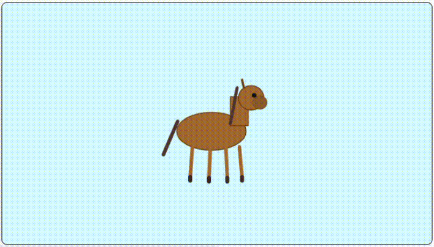{width=inherit}

## Overview
In this project, you will create an interactive clicker game! Every time you click on the horse, it will jump up, say "ouch", and play a sound effect.

You will learn how to:
1. Choose and rename a sprite.
2. Draw a new costume for jumping/reacting.
3. Use click event triggers to make sprites interactive.
4. Use the `say` block to show speech bubbles.
5. Move a sprite using Y-axis coordinates when clicked.


## What You Are Building
* **Horse Sprite:** Jumps up and switches costume whenever clicked.
* **Speech & Sound:** Plays a sound effect and says "ouch" when clicked.


## Part 1 - Setup

Before we begin coding our clicker game, let's set up our workspace by adding our main character and choosing a clean backdrop.


### Step 1 - Open the Designer Panel
Click **"Designer"** on the right panel to open the sprite and background controls.

> 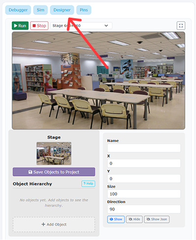{width=inherit}

### Step 2 - Add a New Object
Click **"Add object"** as shown in the interface to open the object library.

> {width=inherit}


### Step 3 - Choose and Name Your Character
1. Search or scroll to find the **Horse**.
2. Click to select it.
3. Change its name to **`Horse`**.

> {width=inherit}


### Step 4 - Select Stage Background
The default background is a bit messy, so let's change it! Click the stage photo icon as shown in the interface.

> 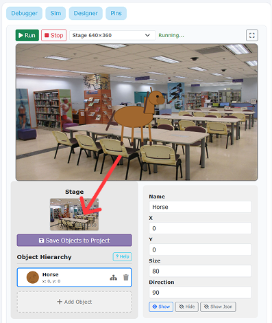{width=inherit}


### Step 5 - Pick a Better Backdrop
Browse the backdrop gallery and select a clean, suitable background for **Horse** to stand on!

> 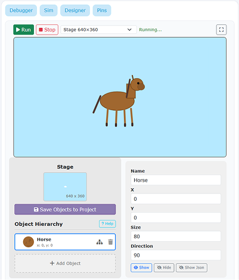{width=inherit}


## Part 2 - Core Building Blocks

Now that **Horse** is on stage, let's learn the core skills needed to make our clicker game: drawing a new costume, switching looks, and playing audio when an event happens.


### Step 1 - Draw A New Costume
1. Click **"Character"** in the top-left corner of the panel.

> 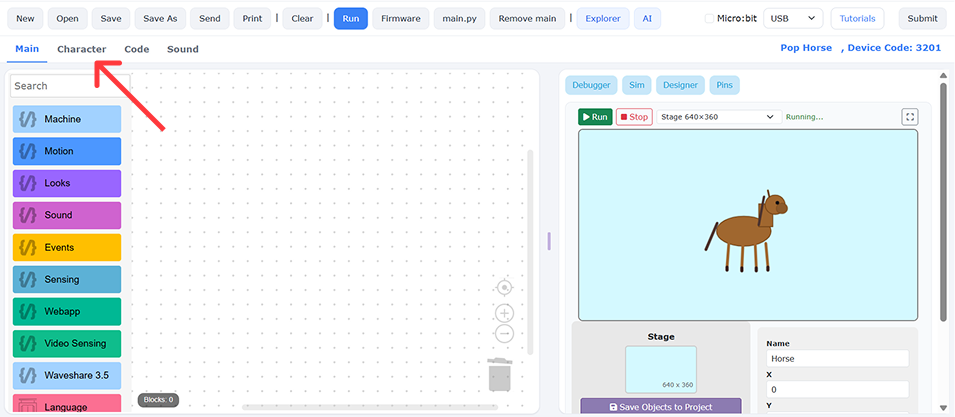{width=inherit}

2. Click the **paint brush** button in the bottom-left corner to create a new costume.

> 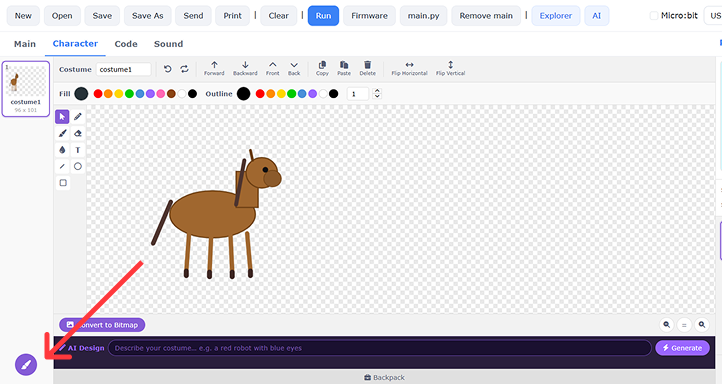{width=inherit}

3. Use the tools to draw 1 new costume for Horse (e.g., an animated pose when hit). See the example below:

> 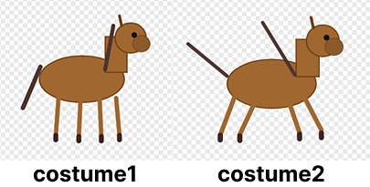{width=inherit}


### Step 2 - Switch Costumes
There are 2 ways to change costumes in MicroPython:
1. `switch costume to "costume1"` – Changes to a specific costume by name.

> 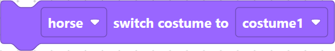{width=inherit}

2. `next costume` – Switches to the very next costume in your list.

> 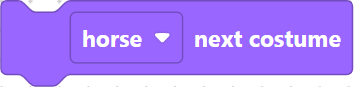{width=inherit}

Try both blocks by placing them inside a `Start` block. After assembling your code, click **Run** in the right panel to test it!

> 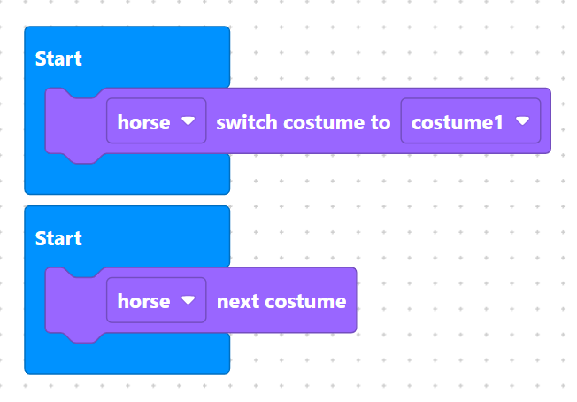{width=inherit} 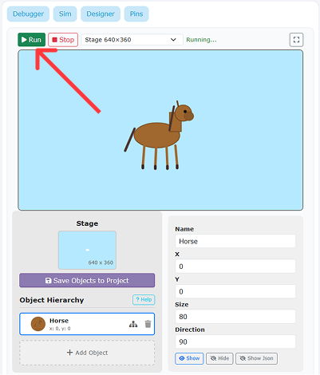{width=inherit}


### Step 3 - Play Sound
By default, every project comes with sound effects. If you want to use your own sound effects or background music, you can click on **"Customise Sound"** in the panel to browse or upload new audio files.

There are 2 main ways to play a sound in SemiBlock:
1. `start sound "pop"` – Plays the sound immediately in the background while your code continues running to the next block.

> {width=inherit}

2. `play sound "pop" until done` – Plays the entire sound and pauses your code until the audio finishes.

> {width=inherit}


### Try It Out!

> {width=inherit}

1. Drag `start sound "pop"` and snap it under a `Start` block.
2. Click **Run** on the right panel to hear Horse make a sound!
3. Try swapping it with `play sound "pop" until done` to see the difference.

---

## Part 3 - Combine It All!

Now let's bring everything together using an **Event Block**! Instead of running when you click the start button, this program triggers whenever you click directly on Horse.

### Click Reaction Routine

Here is the complete code to make Horse react when clicked:

```python

# Event trigger: runs when Horse is clicked
def on_horse_clicked():
    sound.start("horse")
    sprite.next_costume("horse")
    sprite.say_for_seconds("horse", "Ouch!", 0.1)
    sleep(0.1)
    sprite.next_costume("horse")

```

> 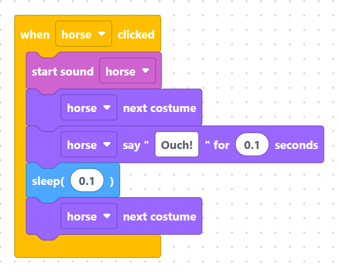{width=inherit}

- `sound.start("horse")`: Plays the horse sound effect immediately when clicked.

- `sprite.next_costume("horse")`: Switches Horse to its next costume pose (e.g., hurt or reacting pose).

- `sprite.say_for_seconds("horse", "Ouch!", 0.1)`: Shows a speech bubble with "Ouch!" above Horse for 0.1 seconds.

- `sleep(0.1)`: Pauses for 0.1 seconds so the reaction pose and speech bubble stay visible to the player.

- `sprite.next_costume("horse")`: Switches back to Horse's original standing costume to complete the click reaction.


## Next Tutorial - Tutorial 1-2: PopHorse

 [Tutorial 1-2: PopHorse - Clicker Game](tut2.md).