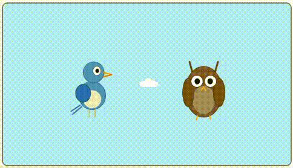
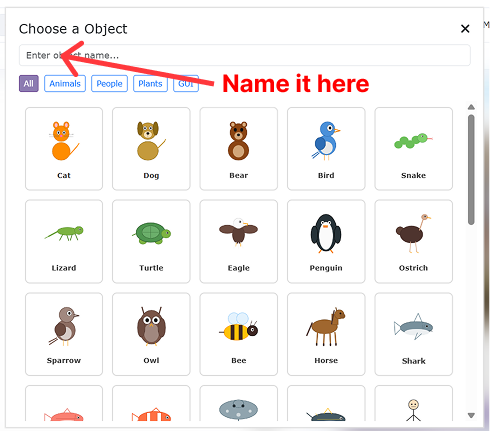
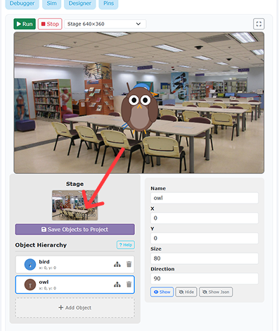
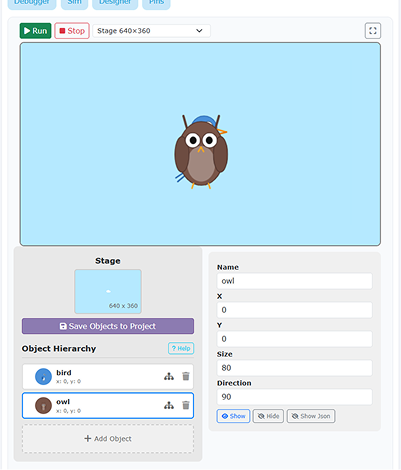
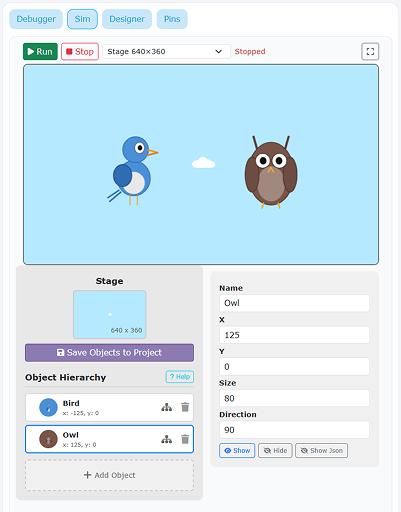
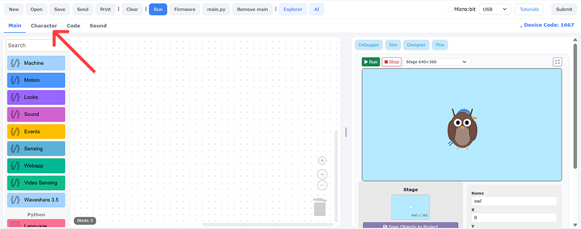
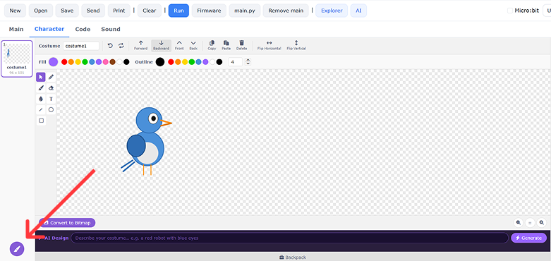
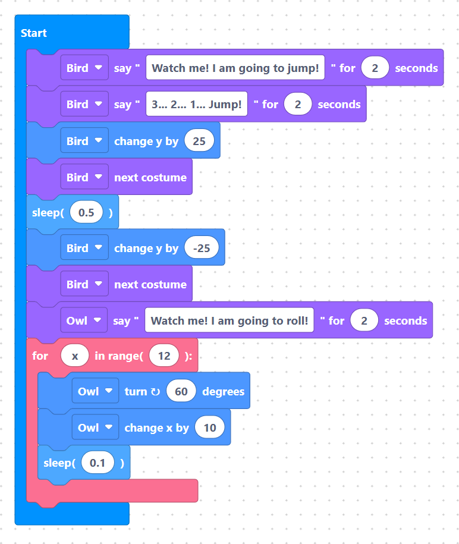

# Tutorial 1-3: Telling Jokes with MicroPython

{width=inherit}

## Overview
In this project, you will create a dialogue animation between two characters on stage! The Bird will perform a jump, and then the Owl will perform a rolling motion across the screen.

You will learn how to:
1. Add and set up multiple characters on stage (`Bird` and `Owl`).
2. Use the `say` block for speech bubbles and timing dialogue.
3. Perform jump movements using Y-axis coordinates and costume changes.
4. Program rotation using `turn degrees` inside a `for` loop to create a roll animation.


## What You Are Building
* **Bird Sprite:** Says dialogue, jumps up (+25 Y), changes costumes, and lands back down (-25 Y).
* **Owl Sprite:** Speaks after the bird, then rotates 60 degrees and moves right (+10 X) inside a loop to roll across the screen.


## Part 1 - Setup
Before we begin coding our dialogue, let's set up our workspace by adding our two characters and choosing a suitable backdrop.


### Step 1 - Open the Designer Panel
Click **"Designer"** on the right panel to open the sprite and background controls.

> {width=inherit}


### Step 2 - Add the First Character (`Bird`)

> {width=inherit} {width=inherit}

1. Click **"Add object"** to open the object library.
2. Search or scroll to find the **Bird**.
3. Select it and change its name to **`Bird`**.


### Step 3 - Add the Second Character (`Owl`)
1. Click **"Add object"** again.
2. Search or scroll to find the **Owl**.
3. Select it and change its name to **`Owl`**.


### Step 4 - Select Stage Background
Click the stage photo icon in the interface and choose a clear backdrop for **Bird** and **Owl**.

> {width=inherit} {width=inherit}


### Step 5 - Position the Characters Side by Side
Drag **Bird** to the left side of the stage and **Owl** to the right side so they are standing next to each other before the animation starts.

> {width=inherit}


### Step 6 - Draw a Jumping Costume for Bird
1. Click **"Character"** in the top-left corner and select **`Bird`**.
2. Click the **paint brush** icon at the bottom-left to add a new costume.
3. Draw a jumping pose for **Bird** (e.g., wings spread upward or legs tucked).

> {width=inherit} {width=inherit}


## Part 2 - Core Building Blocks

Before combining everything, let's review the main blocks used in this project:

### Step 1 - Speech Bubbles (`say`)
Use `sprite.say_for_seconds(name, text, seconds)` to make characters speak in order. The script waits for the speech bubble time to finish before moving to the next block.

> {width=inherit}


### Step 2 - Rotating Sprites (`turn`)
Use `turn right (degrees)` or `turn left (degrees)` to rotate your character. Combining rotation with movement inside a loop makes the sprite look like it is rolling!

> {width=inherit}


## Part 3 - Combine It All!

Here is the complete script to run the story sequence from start to finish:

### Complete Code

```python

# 1. Bird speaks and jumps
sprite.say_for_seconds("Bird", "Watch me! I am going to jump!", 2)
sprite.say_for_seconds("Bird", "3... 2... 1... Jump!", 2)

sprite.change_y("Bird", 25)
sprite.next_costume("Bird")
sleep(0.5)

sprite.change_y("Bird", -25)
sprite.next_costume("Bird")

# 2. Owl speaks and rolls
sprite.say_for_seconds("Owl", "Watch me! I am going to roll!", 2)

for x in range(12):
    sprite.turn_right("Owl", 60)
    sprite.change_x("Owl", 10)
    sleep(0.1)

```

> {width=inherit}

### How the Code Works:
- `sprite.say_for_seconds("Bird", "Watch me! I am going to jump!", 2)`: Bird shows a speech bubble for 2 seconds.

- `sprite.say_for_seconds("Bird", "3... 2... 1... Jump!", 2)`: Bird counts down before leaping.

- `sprite.change_y("Bird", 25)` & `sprite.next_costume("Bird")`: Bird moves up 25 pixels and switches to its jumping costume pose.

- `sleep(0.5)`: Holds the jump pose in mid-air for half a second.

- `sprite.change_y("Bird", -25)` & `sprite.next_costume("Bird")`: Bird drops back down 25 pixels to land and resets to its standing costume.

- `sprite.say_for_seconds("Owl", "Watch me! I am going to roll!", 2)`: Owl speaks after Bird finishes landing.

- `for x in range(12):`: Loops 12 times to perform the rolling animation.

- `sprite.turn_right("Owl", 60)`: Rotates Owl 60 degrees clockwise per step ($12 \times 60^\circ = 720^\circ$, making 2 full spins).

- `sprite.change_x("Owl", 10)`: Moves Owl 10 pixels to the right with each rotation step.

- `sleep(0.1)`: Pauses for 0.1 seconds between loop steps to keep the rolling animation smooth.

## Common Mistakes to Avoid

1. **Targeting the Wrong Sprite Name**
   * **Problem:** Owl jumps instead of Bird, or Bird rotates.
   * **Fix:** Double-check the target name in each block! Make sure the jump blocks target `"Bird"` and the spin/move blocks target `"Owl"`.

2. **Forgetting `sleep(0.1)` Inside the Roll Loop**
   * **Problem:** Owl teleports across the screen instantly without showing the spinning roll.
   * **Fix:** Always include a small delay inside `for` loops that animate movement or rotation.

3. **Incomplete Rotation**
   * **Problem:** Owl ends up upside down or tilted after rolling.
   * **Fix:** Ensure the number of iterations multiplied by the degrees equals a multiple of $360^\circ$ ($12 \times 60^\circ = 720^\circ = 2 \text{ full circles}$).